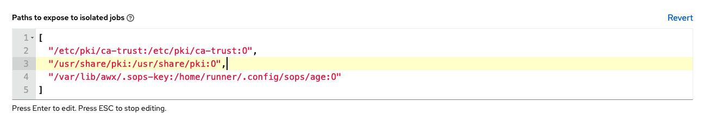

## Introduction

Today, I am excited to share how to set up an Ansible execution environment to control SOPS secrets. The Ansible execution image is a pre-built container containing all the necessary components for decrypting SOPS secrets in Ansible playbooks.

## Ansible Builder

[Ansible Builder](https://ansible-builder.readthedocs.io/en/stable/) is a tool that can help with building the image

### Create a working directory

Let's start by creating a new working directory

```bash
mkdir custom-ansible-execution; cd custom-ansible-execution
```

### Builder definition

Create an `execution-environment.yml` file. ansible-builder build container images with the definition file `execution-environment.yml`

In Ansible Builder, the `additional_build_steps`` configuration allows you to specify additional commands or steps to be executed during the build process. This can be useful for performing custom tasks, installing specific dependencies, or executing scripts as part of the Ansible collection build.

Highlighted code block shows how to add `SOPS` rpm package via additional build steps

```yaml {linenos=table,hl_lines="4-8"}
version: 1
build_arg_defaults:
  EE_BASE_IMAGE: 'registry.redhat.io/ansible-automation-platform-22/ee-supported-rhel8:latest'
additional_build_steps:
  prepend: |
    RUN rpm -i https://github.com/mozilla/sops/releases/download/v3.7.3/sops-3.7.3-1.x86_64.rpm && \
      sops -v && \
      mkdir -p /home/runner/.config/sops/age
dependencies:
  galaxy: requirements.yml
```

### Ansible collections

Create and add the SOPS collection to the `requirements.yml`

```yaml
collections:
  - community.sops
```

### Create context files

`ansible-buidler create` Creates a build context, which can be used by podman to build an image.

```bash
ansible-builder create
Complete! The build context can be found at: custom-ansible-execution/context
```

### Build and push image

Build the container image using Podman and push to a registry

```bash
podman build -f context/Containerfile -t localhost/custom-ee:1.0 context
podman push ...
```

### Execution environments in jobs

Follow this [guide](https://docs.ansible.com/automation-controller/latest/html/userguide/execution_environments.html#use-an-execution-environment-in-jobs) to add an execution environment in Jobs

### Mount options

Mount the SOPS keys to decrypt using [Execution environment mount options](https://docs.ansible.com/automation-controller/latest/html/userguide/execution_environments.html#execution-environment-mount-options)



### Copy sops keys

Finally, SSH into the ansible controller and change to awx user to copy the key into the appropriate directory

```bash
ssh aap-controller
sudo su - awx
sudo mkdir -p /var/lib/awx/.sops-key
sudo mv keys.txt /var/lib/awx/.sops-key 
```

Thank you for taking the time to read my blog post. Until next time, take care!
