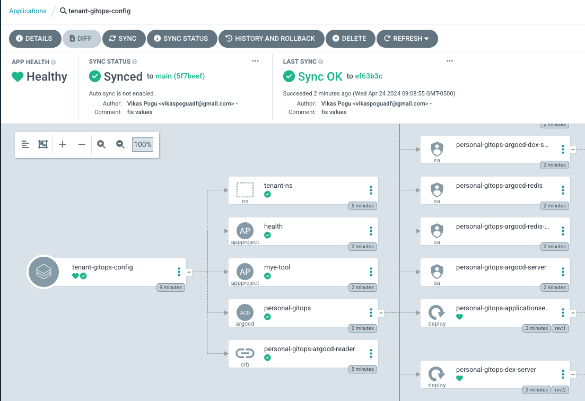

+++
title = "Helm Multi-Values Plugin with Argo's CMP"
date = 2024-04-23T14:55:24-05:00
draft = false
tags = ["ArgoCD", "Config Management Plugin", "Helm", "Multi Values"]
+++

## Introduction

With the current version of [Helm](https://helm.sh), it's not possible to merge multiple values files. It will override the list from the preceding values file. While trying to solve this problem, I stumbled upon this custom [plugin](https://github.com/nico-ulbricht/helm-multivalues) that can take a folder of values files and split them into individual files. This plugin is what I was looking for to solve my problem. Finally, I want to integrate this plugin into my ArgoCD instance.

You'll need to perform the following steps:

- Install Helm [Plugin](https://helm.sh/docs/topics/plugins/) using InitContainer of the repo server.
- The configuration management plugin installation entails two steps. First, create a ConfigMap of your CMP configuration, then configure the plugin via sidecar for the repo server. For additional details, see the ArgoCD [documentation](https://argo-cd.readthedocs.io/en/stable/operator-manual/config-management-plugins/).
- Finally, create an Argo Application to test the multi-values plugin.

### Prerequisites

- Make sure you have access to the OpenShift cluster with cluster-admin privileges.
- The OpenShift GitOps Operator must be installed and configured
- It would help if you had some understanding of ArgoCD and Helm Charts.

### Install Helm Plugin in repo server

We'll use the [custom tooling](https://argocd-operator.readthedocs.io/en/latest/usage/customization/) methodology to add the helm multivalues plugin to the repo server. Update the ArgoCD operator [CR](https://argocd-operator.readthedocs.io/en/latest/reference/argocd/) to add an init container to the repo spec and volumes to install the helm plugin. We must also add Helm environment variables to override default `data`, `config`, and `cache` paths.

```yaml {linenos=table,hl_lines="21-39",linenostart=1}
apiVersion: argoproj.io/v1alpha1
kind: ArgoCD
metadata:
  name: openshift-gitops
  namespace: openshift-gitops
spec:
  repo:
    volumes:
      - configMap:
          name: helm-multivalues-plugin
        name: helm-multivalues-plugin
      - name: helm-custom-config
        emptyDir: {}
    env:
      - name: HELM_CACHE_HOME
        value: /.config/helm/cache
      - name: HELM_CONFIG_HOME
        value: /.config/helm/cache
      - name: HELM_DATA_HOME
        value: /.config/helm/data
    initContainers:
      - name: install-helm-multivalues-plugin
        image: registry.redhat.io/openshift-gitops-1/argocd-rhel8@sha256:baec6d73a77b832df8131bac3c5a86dc405ef89f600e27a22f164ed3c72816db
        command: [sh, -c]
        args:
          - "helm plugin install https://github.com/nico-ulbricht/helm-multivalues"
        env:
          - name: HELM_CACHE_HOME
            value: /helm-custom-config/cache
          - name: HELM_CONFIG_HOME
            value: /helm-custom-config/cache
          - name: HELM_DATA_HOME
            value: /helm-custom-config/data
        volumeMounts:
          - mountPath: /helm-custom-config
            name: helm-custom-config
    volumeMounts:
      - mountPath: /.config/helm
        name: helm-custom-config
```

### Configure Argo CMP

Next, create a ConfigMap with the configuration for the plugin. The `generate` command under `spec` section runs in the Application source directory each time manifests need to generate output. As per the plugin [documentation](https://github.com/nico-ulbricht/helm-multivalues?tab=readme-ov-file#usage), we need to run the `helm multivalues [ORIGINAL_COMMAND] -f [VALUES_FOLDER_PATH] [ORIGINAL_ARGS]` to generate the output as a `stdout`

```yaml {linenos=table,hl_lines="13-14",linenostart=1}
apiVersion: v1
kind: ConfigMap
metadata:
  name: helm-multivalues-plugin
  namespace: openshift-gitops
data:
  plugin.yaml: |
    apiVersion: argoproj.io/v1alpha1
    kind: ConfigManagementPlugin
    metadata:
      name: helm-multivalues-plugin
    spec:
      generate:
        command: [sh, -c, 'helm multivalues template $ARGOCD_APP_NAME $ARGOCD_ENV_CHART_PATH --values $ARGOCD_ENV_VALUES_FILE -f $ARGOCD_ENV_VALUES_FOLDER']
```

The next step is to add the [sidecar](https://argo-cd.readthedocs.io/en/stable/operator-manual/config-management-plugins/#register-the-plugin-sidecar) to the ArgoCD operator CR.

```yaml {linenos=table,hl_lines="8-30"}
apiVersion: argoproj.io/v1alpha1
kind: ArgoCD
metadata:
  name: openshift-gitops
  namespace: openshift-gitops
spec:
  repo:
    sidecarContainers:
      - name: helm-multivalues-plugin
        command: [/var/run/argocd/argocd-cmp-server]
        image: registry.redhat.io/openshift-gitops-1/argocd-rhel8@sha256:baec6d73a77b832df8131bac3c5a86dc405ef89f600e27a22f164ed3c72816db
        env:
          - name: HELM_CACHE_HOME
            value: /.config/helm/cache
          - name: HELM_CONFIG_HOME
            value: /.config/helm/cache
          - name: HELM_DATA_HOME
            value: /.config/helm/data
        volumeMounts:
          - mountPath: /var/run/argocd
            name: var-files
          - mountPath: /home/argocd/cmp-server/plugins
            name: plugins
          - mountPath: /tmp
            name: tmp
          - mountPath: /home/argocd/cmp-server/config/plugin.yaml
            subPath: plugin.yaml
            name: helm-multivalues-plugin
          - mountPath: /.config/helm
            name: helm-custom-config
    volumes:
      - configMap:
          name: helm-multivalues-plugin
        name: helm-multivalues-plugin
      - name: helm-custom-config
        emptyDir: {}
    env:
      - name: HELM_CACHE_HOME
        value: /.config/helm/cache
      - name: HELM_CONFIG_HOME
        value: /.config/helm/cache
      - name: HELM_DATA_HOME
        value: /.config/helm/data
    initContainers:
      - name: install-helm-multivalues-plugin
        image: registry.redhat.io/openshift-gitops-1/argocd-rhel8@sha256:baec6d73a77b832df8131bac3c5a86dc405ef89f600e27a22f164ed3c72816db
        command: [sh, -c]
        args:
          - "helm plugin install https://github.com/nico-ulbricht/helm-multivalues"
        env:
          - name: HELM_CACHE_HOME
            value: /helm-custom-config/cache
          - name: HELM_CONFIG_HOME
            value: /helm-custom-config/cache
          - name: HELM_DATA_HOME
            value: /helm-custom-config/data
        volumeMounts:
          - mountPath: /helm-custom-config
            name: helm-custom-config
    volumeMounts:
      - mountPath: /.config/helm
        name: helm-custom-config
```

A few things to review:

- The code snippet above uses an argocd image to mount the plugin we installed in the earlier step and `plugin.yaml` in the container using the ConfigMap we just created.
- Other mounts from Argo CD are necessary, like `/var/run/argocd` (that contains the argocd-cmp-server command that needs to run) and `/home/argocd/cmp-server/plugins`.

Apply the changes; Operator will rollout a latest changes of the repo-server pod.

### Argo Application to Validate

Let's set up an ArgoCD application to test the changes

```yaml {linenos=table,hl_lines="14-22"}
apiVersion: argoproj.io/v1alpha1
kind: Application
metadata:
  name: tenant-gitops-config
  namespace: openshift-gitops
spec:
  destination:
    server: "https://kubernetes.default.svc"
  project: default
  source:
    path: .
    repoURL: "https://github.com/Vikaspogu/openshift-multicluster.git"
    targetRevision: main
    plugin:
      name: helm-multivalues-plugin
      env:
        - name: CHART_PATH
          value: helm/charts/tenant-gitops
        - name: VALUES_FOLDER
          value: kustomize/cluster-overlays/dev-acm/tenant-gitops-helm/apps
        - name: VALUES_FILE
          value: kustomize/cluster-overlays/dev-acm/tenant-gitops-helm/values.yaml
  syncPolicy:
    retry:
      backoff:
        duration: 120s
        factor: 3
        maxDuration: 10m0s
      limit: 10
    syncOptions:
      - SkipDryRunOnMissingResource=true
      - Validate=false
      - ApplyOutOfSyncOnly=true
      - RespectIgnoreDifferences=true
      - Prune=true
```



Success! The Config Management Plugin ran the commands in the generate section to render out the YAML and Argo CD applied that YAML to the destination cluster.

## Resources

- Helm Chart [Repository](https://github.com/Vikaspogu/openshift-multicluster/tree/main/helm/charts/tenant-gitops)
- Helm MultiValues [Folder](https://github.com/Vikaspogu/openshift-multicluster/tree/main/kustomize/cluster-overlays/dev-acm/tenant-gitops-helm)
