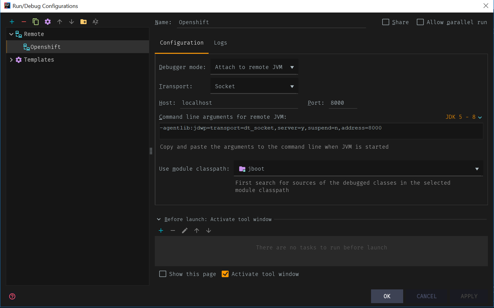
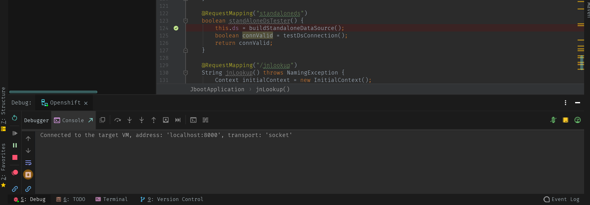

+++
title="Debugging a Java application in OpenShift."
date= 2019-05-14
tags=["OpenShift", "Java"]
slug="debug-java-container"
socialShare=true
+++

This post will discuss debugging a JAVA application running inside a container.

## Red Hat container images

When you bootstrap your JVM, you should have a way to enable JVM to debug. For example, Red Hat S2I images allow you to control classpath and debugging via environment variables.

```bash
# Set debug options if required
if [ x"${JAVA_DEBUG}" != x ] && [ "${JAVA_DEBUG}" != "false" ]; then
    java_debug_args="-agentlib:jdwp=transport=dt_socket,server=y,suspend=n,address=${JAVA_DEBUG_PORT:-5005}"
fi
```

1. Setting the `JAVA_DEBUG` environment variable inside the container to `true` will append debug args to the JVM startup command
2. Configure port forwarding so that you can connect to your application from a remote debugger

> If you are using the `tomcat` image, replace the `JAVA_DEBUG` environment variable with `DEBUG`

Using the oc command, list the available deployment configurations:

```bash
oc get dc
```

### Enable Debug

Set the `JAVA_DEBUG` environment variable in the deployment configuration of your application to `true`, which configures the JVM to open the port number `5005` for debugging.

```bash
oc set env dc/MY_APP_NAME JAVA_DEBUG=true
```

> Disabling the health checks is not mandatory but recommended because a pod could be restarted during remote debugging while the process is paused. You can remove the readiness check to prevent a forced restart.

### Redeploy

Redeploy the application if it is not set to redeploy automatically on configuration change.

```bash
oc rollout latest dc/MY_APP_NAME
```

Configure port forwarding from your local machine to the application pod. List the currently running pods and find one containing your application. `$LOCAL_PORT_NUMBER` is an unused port number of your choice on your local machine. Remember this number for the remote debugger configuration.

> If you are using the `tomcat` image, replace the port `5005` with `8000`

```bash
oc get pod
NAME                            READY     STATUS      RESTARTS   AGE
MY_APP_NAME-3-1xrsp             1/1       Running     0          6s
...
oc port-forward MY_APP_NAME-3-1xrsp $LOCAL_PORT_NUMBER:5005
```

### IntelliJ Config

Create a new debug configuration for your application in `IntelliJ IDE:

1. Click Run → Edit Configurations
2. In the list of configurations, add Remote. Creates a new remote debugging configuration
3. Enter a suitable name for the configuration in the name field
4. Set the port field to the port number that your application is listening on for debugging
5. Click Apply

   

6. Click Run -> Debug -> Select Profile

   

When done debugging, unset the `JAVA_DEBUG` environment variable in your application pod.

```bash
oc set env dc/MY_APP_NAME JAVA_DEBUG-
```

## Non-Red Hat container images

If you are using the `OpenJDK` image to build an application, update `ENTRYPOINT` as below to pass options to the JVM through the `$JAVA_OPTS` environment variable

```Dockerfile
FROM openjdk:11.0.3-jdk-slim
RUN mkdir /usr/myapp
COPY target/java-kubernetes.jar /usr/myapp/app.jar
WORKDIR /usr/myapp
EXPOSE 8080
ENTRYPOINT [ "sh", "-c", "java $JAVA_OPTS -jar app.jar" ]
```

And then set deployments `JAVA_OPTS` environment variable.

```bash
oc set env deployment MY_APP_NAME JAVA_OPTS=-agentlib:jdwp=transport=dt_socket,address=*:5005,server=y,suspend=n
```
