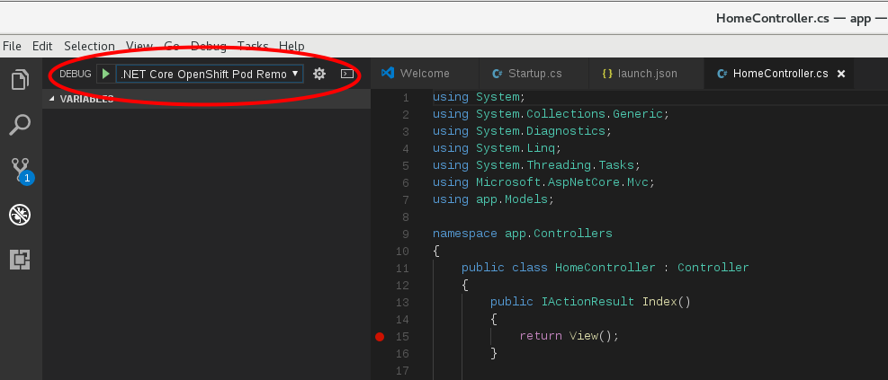

+++
title="Debugging a .NET Core application running on OpenShift"
date="2019-05-14"
tags=["OpenShift", "dot net"]
slug="debug-netcore-OpenShift"
socialShare=true
+++

This post concerns remote debugging an ASP.NET Core application on OpenShift using Visual Studio Code. You can use any Microsoft proprietary debugger engine `vsdbg` with Visual Studio Code.

First, list the available .Net application pods using the `oc` command.

```bash
$ oc get pod
    NAME                            READY     STATUS      RESTARTS   AGE
    MY_APP_NAME-3-1xrsp          0/1       Running     0          6s
$ oc rsh MY_APP_NAME-3-1xrsp
sh-4.2$  curl -sSL https://aka.ms/getvsdbgsh | bash /dev/stdin -v latest -l /opt/app-root/vsdbg -r linux-x64
```

**Note:** If your container is running behind a corporate proxy and cannot access the internet, you'll have to build a base dotnet image with the installed debugger engine `vsdbg`.

Create (or open) the `.vscode/launch.json` file inside the source directory of the application (i.e., at the same level as the project folder), then add the following:

```json
{
  "version": "0.1.0",
  "configurations": [
    {
      "name": ".NET Core OpenShift Pod Remote Attach",
      "type": "coreclr",
      "request": "attach",
      "processId": "1",
      "pipeTransport": {
        "pipeProgram": "oc",
        "pipeArgs": ["exec", "-it", "<replace-with-pod-name>", "--"],
        "quoteArgs": false,
        "debuggerPath": "/opt/app-root/vsdbg/vsdbg",
        "pipeCwd": "${workspaceRoot}"
      },
      "justMyCode": false,
      "sourceFileMap": { "/opt/app-root/src": "${workspaceRoot}" }
    }
  ]
}
```

In `Launch.json, ` replace `<replace-with-pod-name>` with the pod's name.

Confirm the PID of the `dotnet` process in the container. If different, replace the `processId` in `launch.json` with the appropriate value. Usually, this value is `1`.

If the application is built with the `Release` configuration, the default for .NET Core S2I builder images, `justMyCode` should be `false`.

As S2I images build the source code in the `/opt/app-root/src` folder, we should specify this path for `sourceFileMap`.

Start debugging the .NET Core app by switching to the debug window, then select `.NET Core OpenShift Pod Remote Attach` as the configuration and click on the green play button (as shown below), or press the F5 key.



Remember to add the breakpoints in the source code to see debugging in action!
