+++
title = 'Getting Started with Red Hat Developer Hub - Part 2'
date = 2024-01-14T11:51:33-06:00
draft = false
tags=["Red Hat Developer Hub","Backstage","IDP"]
+++

In this [continuation](https://vikaspogu.dev/blog/developer-hub-getting-started-part-1/) of our getting started with Developer Hub series, we're diving into the art of crafting templates. These templates will not only streamline your workflow but also serve as the cornerstone for automated deployments.

## High-level overview

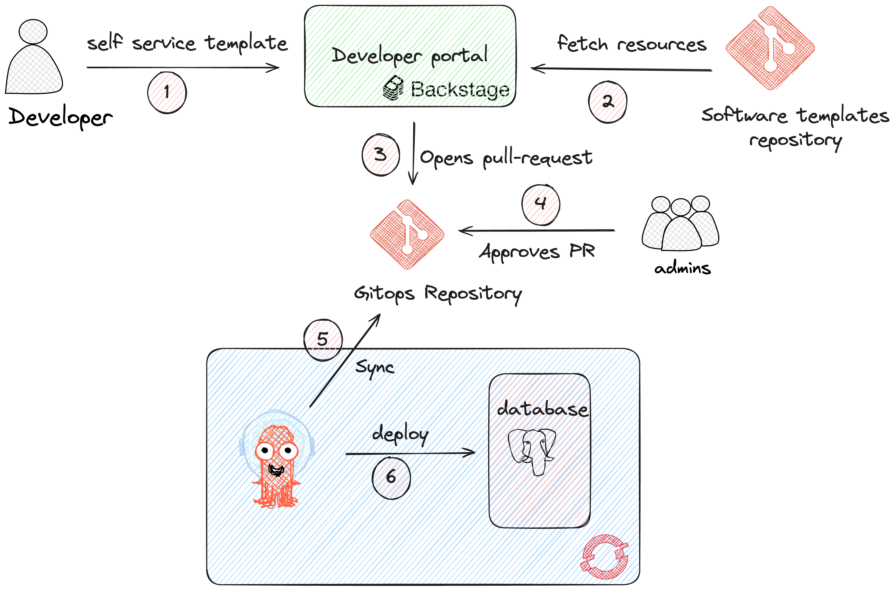

The developer initiates the workflow by leveraging the backstage self-service template. This template, in turn, pulls essential skeleton resources from a dedicated software template repository, ensuring consistency and best practices. The developer's actions trigger the creation of a pull request to the GitOps repository, introducing version-controlled changes to the infrastructure. An admin reviews and approves the pull request. Then, ArgoCD, a continuous delivery tool, provides the database resources according to the approved changes. This seamless integration of backstage, GitOps, and ArgoCD accelerates the development lifecycle. It fosters a collaborative environment where developers and administrators work harmoniously to deliver robust and scalable database solutions.

## Define Your Infrastructure

Before diving into templates, define the infrastructure you want to provision. In our case, let's consider provisioning a PostgreSQL database using CloudNative-PG. Let's start with the installation of the CloudNative-PG operator on OpenShift cluster.

### Prerequisites

- Ensure you have access to the cluster with cluster-admin privileges.
- Verify access to the OpenShift Container Platform web console.

### Procedure

- Log in to the OpenShift Container Platform web console.
- Navigate to Operators → OperatorHub.
- Enter `cloudnativepg` into the filter box.
- Select the CloudNativePG and click Install.

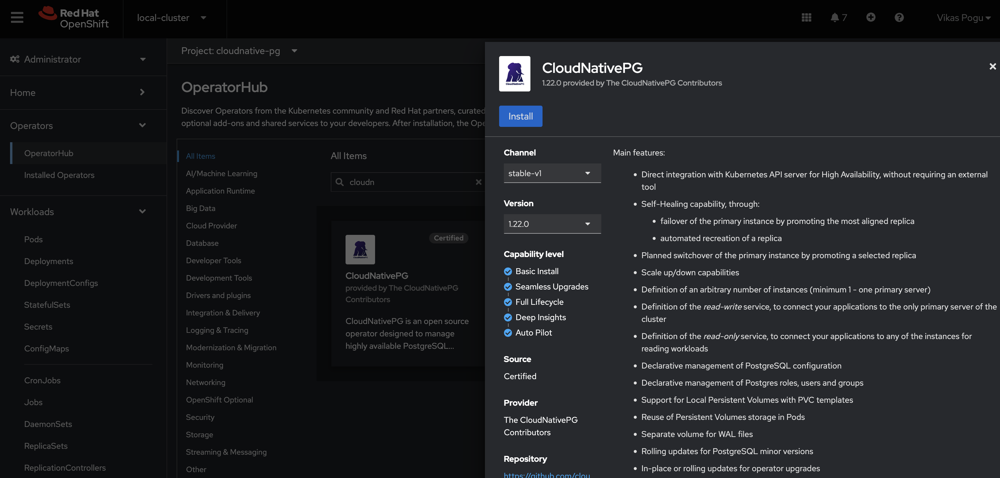

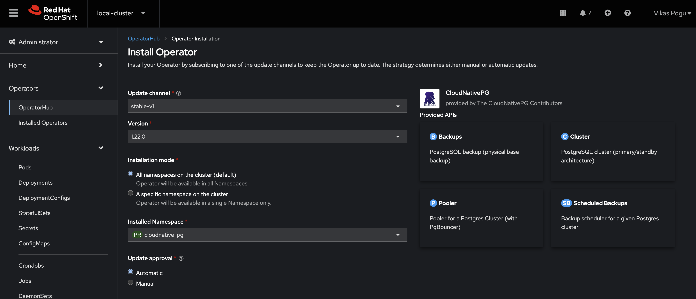

## Backstage Software Template

Create a software template under a kind `Template`. This template will automate the process of opening a GitHub pull request for provisioning.

I recommend referring to [documentation](https://backstage.io/docs/features/software-templates/adding-templates) on creating templates and using `Template Editor` from the developer hub for quick feedback.

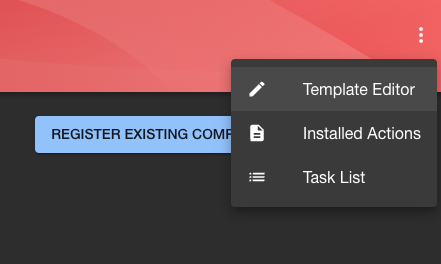

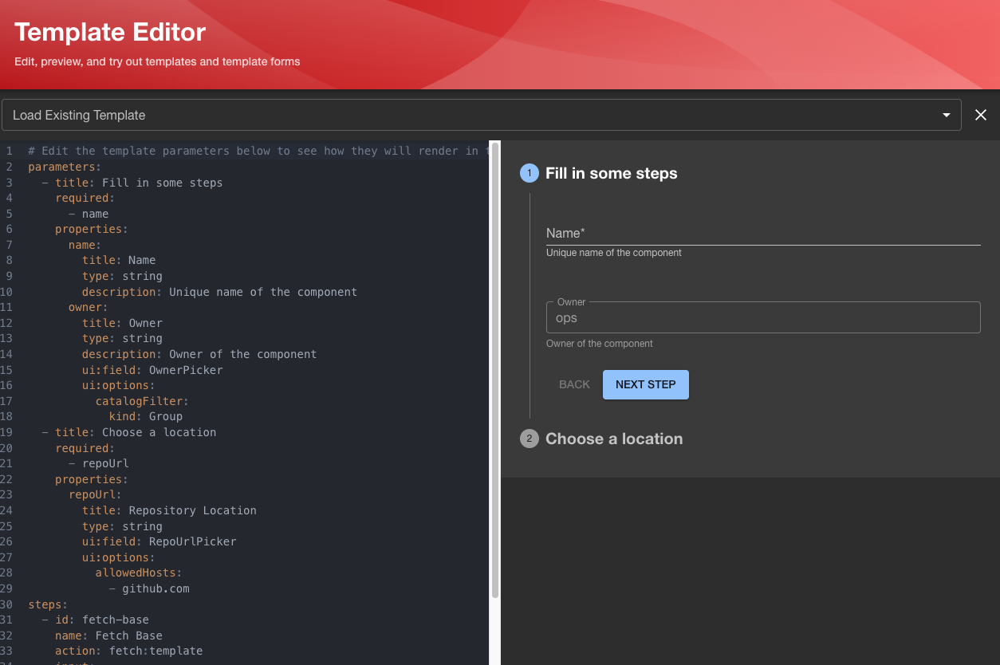

The outcome of the template would be as follows, based on the flow we discussed in the overview. Feel free to modify the YAML as required and test the changes in the template form editor for quicker feedback

```yaml
---
apiVersion: scaffolder.backstage.io/v1beta3
kind: Template
metadata:
  name: postgresql-cluster
  title: Postgresql Cluster template
  description: scaffolder v1beta3 template to create pgsql cluster on existing git repository
  tags:
    - database
    - postgresql
  links:
    - title: Documentation
      url: https://backstage.io/docs/features/software-templates
      icon: docs
    - title: Source
      url: https://github.com/Vikaspogu/software-templates/blob/main/scaffolder-templates/pgsql-cluster/template.yaml
      icon: github
spec:
  owner: group:ops
  type: service
  parameters:
    - title: Postgresql Definition
      required:
        - namespace
      properties:
        environment:
          title: Select environment
          type: string
          default: dev
          enum:
            - prod
            - stage
            - dev
          enumNames:
            - 'production (prod)'
            - 'staging (stage)'
            - 'development (dev)'
        cluster:
          title: Select openshift cluster
          type: string
          default: acm
          enum:
            - acm
            - dev
            - prod
          enumNames:
            - 'acm (acm)'
            - 'development (dev)'
            - 'production (prod)'
        namespace:
          title: Namespace
          type: string
          description: Namespace of the postgresql cluster
        create_namespace:
          title: Create a namespace
          type: boolean
        instances:
          title: Instances
          type: integer
          description: Number of instances required in the cluster
          default: 1
        storage_size:
          title: Storage Size
          type: string
          description: Size of the storage (ex. 1Gi)
          default: 1Gi
        owner:
          title: Owner
          type: string
          description: Owner of the component
          ui:field: OwnerPicker
          ui:options:
            catalogFilter:
              kind: Group
    - title: Provide information about the GitHub location
      required:
        - repoOwner
        - repoName
        - owner
      properties:
        repoOwner:
          title: Repository Owner
          type: string
          default: vikaspogu
        owner:
          title: Owner
          type: string
          description: Owner of the component
        repoName:
          title: Repository Name
          type: string
          default: cluster-components
            
  steps:
    - id: fetch-base
      name: Fetch Base
      action: fetch:template
      input:
        url: ./skeleton
        values:
          cluster: ${{parameters.cluster}}
          environment: ${{parameters.environment}}
          name: ${{parameters.namespace}}-${{parameters.environment}}-db
          namespace: ${{parameters.namespace}}-${{parameters.environment}}
          instances: ${{parameters.instances}}
          storage_size: ${{parameters.storage_size}}
          create_namespace: ${{parameters.create_namespace}}
          repoOwner: ${{ parameters.repoOwner }}
          repoName: ${{ parameters.repoName }}
          owner: ${{ parameters.owner }}
          applicationType: resources

    - id: publish
      name: Create a pull request
      action: publish:github:pull-request
      input:
        repoUrl: github.com?owner=${{ parameters.repoOwner }}&repo=${{ parameters.repoName }}
        branchName: pqsql/${{parameters.namespace}}-${{parameters.environment}}
        title: "Create a new pgsql database in ${{parameters.namespace}}"
        description: |
          ### Requesting new pgsql database in ${{parameters.namespace}}

          This pull request is generated by IDP catalog

    - id: label_pr
      name: Add labels to PR
      action: github:issues:label
      input:
        repoUrl: github.com?owner=${{ parameters.repoOwner }}&repo=${{ parameters.repoName }}
        number: '${{ steps.publish.output.pullRequestNumber }}'
        labels:
          - postgresql
          - created-by-backstage
          - ${{ parameters.environment }}
          - ${{parameters.namespace}}

  output:
    links:
      - title: 'Pull request link'
        url: ${{ steps.publish.output.remoteUrl }}
        icon: github
```

## Adding template

To incorporate the template files, I'm adopting a static location configuration. In this approach, we specify the template URL within the catalog section of the `app-config-rhdh` configmap, as demonstrated below

```yaml
catalog:
  rules:
    - allow: [Component, System, API, Resource, Location, Template]
  locations:
    - type: url
      target: https://github.com/Vikaspogu/software-templates/blob/main/scaffolder-templates/pgsql-cluster/template.yaml
      rules:
        - allow: [Template]
```

After updating the configmap, recreate the pod. Once the pod is ready, you'll discover the template in the create menu.

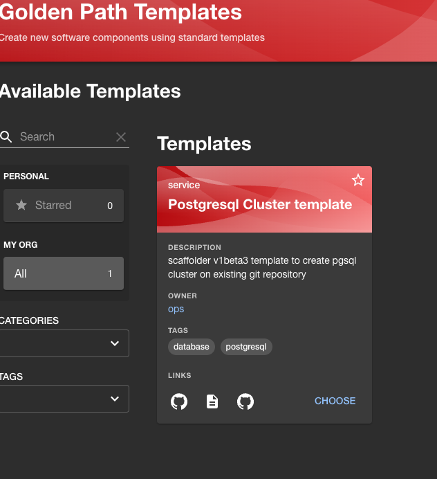

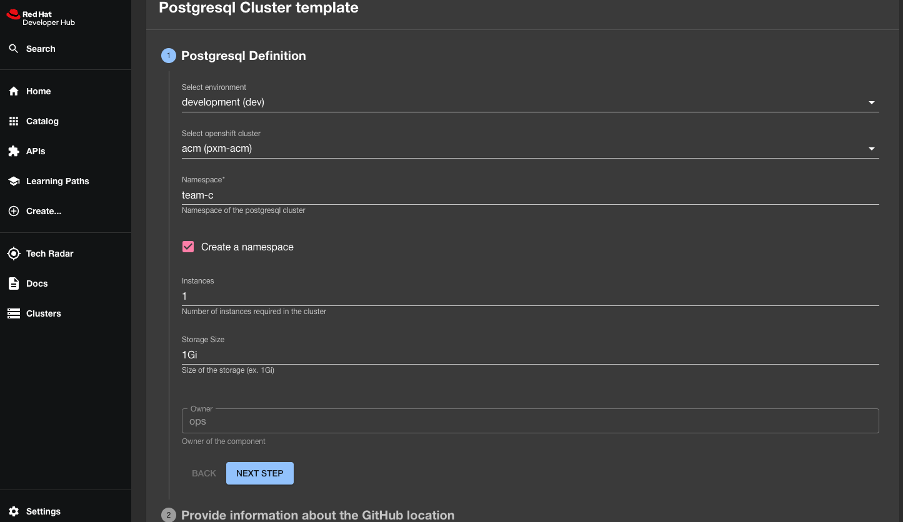

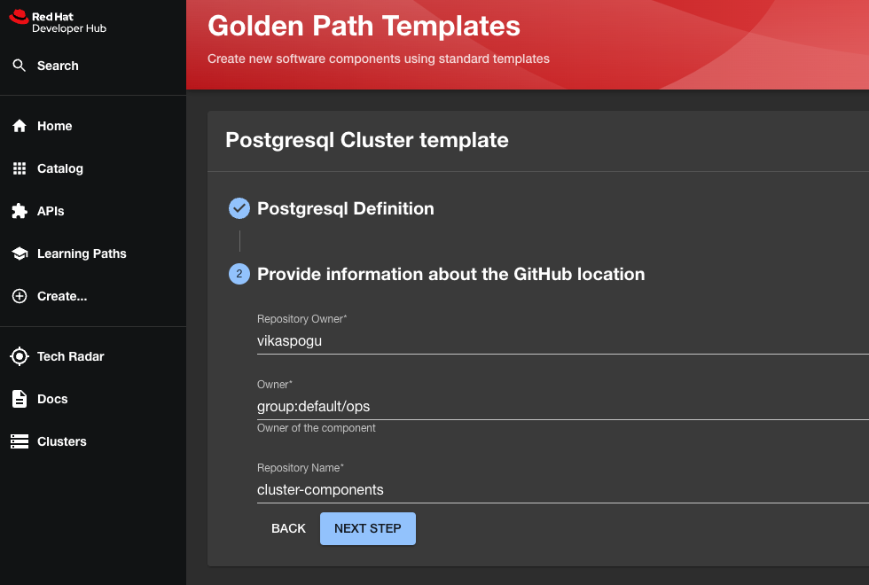

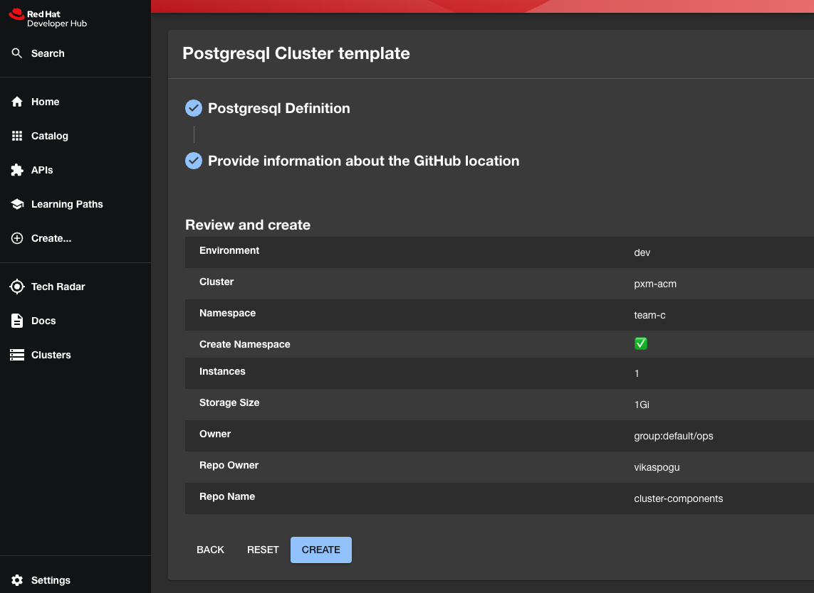

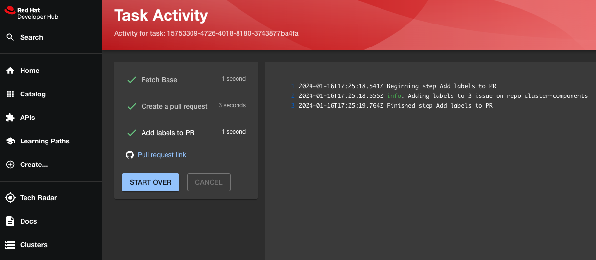

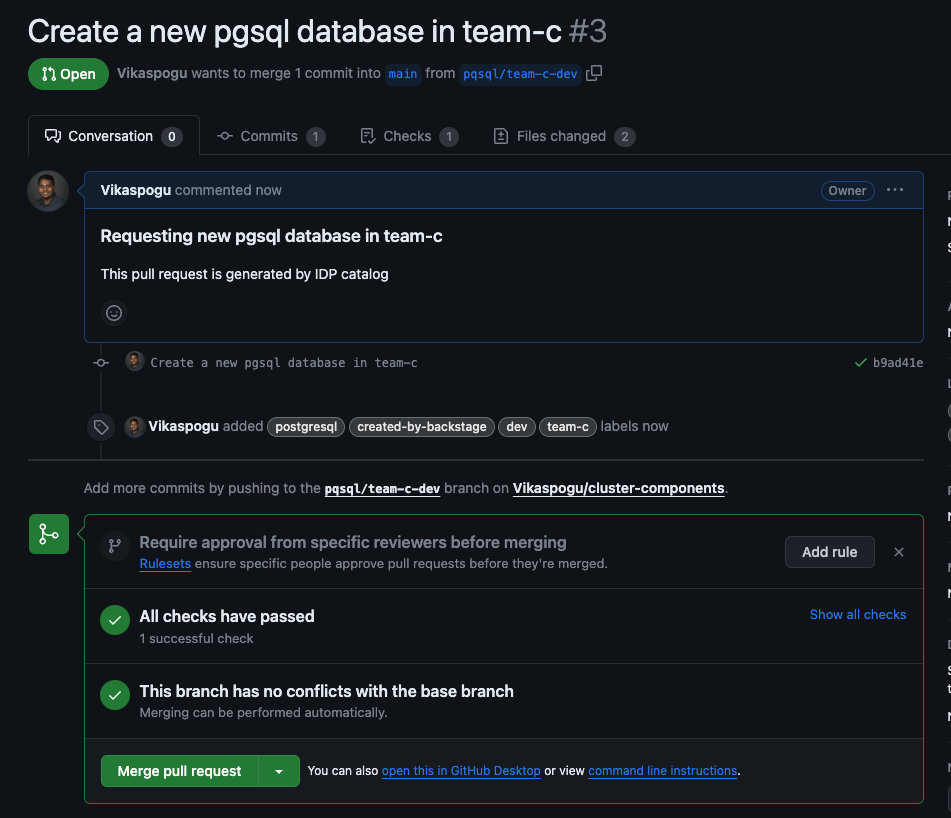

## ArgoCD Application Manifest

Create an ArgoCD application manifest that corresponds to your Backstage template. This manifest specifies the desired state of your application.

```yaml
apiVersion: argoproj.io/v1alpha1
kind: Application
metadata:
  name: cluster-components
  namespace: openshift-gitops
  labels:
    type: config
spec:
  destination:
    server: "https://kubernetes.default.svc"
  project: default
  source:
    directory:
      recurse: true
      exclude: "**/catalog-info.yaml"
    path: acm
    repoURL: "https://github.com/Vikaspogu/cluster-components"
  syncPolicy:
    automated:
      prune: true
      selfHeal: true
    syncOptions:
      - CreateNamespace=true
      - RespectIgnoreDifferences=true
      - ApplyOutOfSyncOnly=true
```

## Test Your Workflow

Merge the pull request generated from the template, then witness ArgoCD autonomously deploying the changes according to the updated desired state. Confirm that the PostgreSQL database cluster has been provisioned as anticipated.

## Conclusion

Congratulations! You've now crafted a powerful template that seamlessly integrates Backstage and ArgoCD. This template not only simplifies your deployment workflow but also introduces automation through GitHub pull requests.
