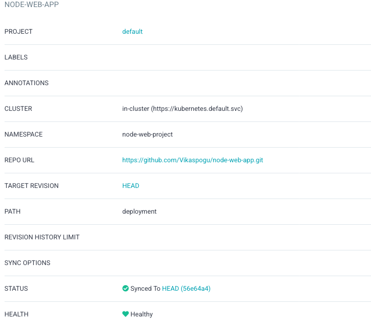
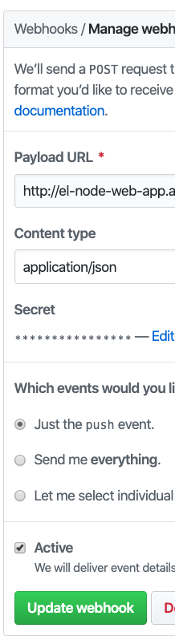
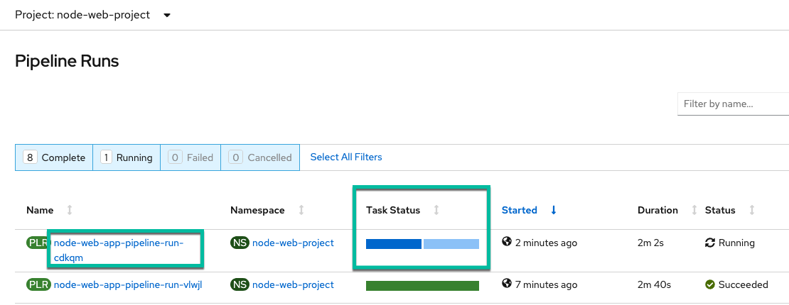

+++ 
date = 2021-01-14
title = "GitOps with Tekton and ArgoCD"
description = "build and release pipeline with Tekton, ArgoCD using GitOps principals."
slug = "tekton-argocd-gitops" 
tags = ["argocd", "tekton", "gitops", "OpenShift-pipelines"]
categories = []
externalLink = ""
series = []
socialShare=true
+++

In this post, I will:

- Use Tekton to build and publish an image to the docker registry
- Trigger a Tekton pipeline from GitHub
- Use ArgoCD to deploy an application


## Getting Started

_**Pre-requisites:**_

- An OpenShift 4 cluster with ArgoCD and OpenShift Pipelines installed. If not, you follow instructions to [OpenShift Pipelines](https://docs.OpenShift.com/container-platform/4.6/pipelines/installing-pipelines.html) and [ArgoCD Operator](https://argocd-operator.readthedocs.io/en/latest/install/OpenShift/)
- Basic understanding of ArgoCD and Tekton concepts

Create an OpenShift project called `node-web-project`

```bash
oc new-project node-web-project
```

### Using Private Registries

Create a docker secret with registry authentication details

```bash
oc create secret docker-registry container-registry-secret \
  --docker-server=$CONTAINER_REGISTRY_SERVER \
  --docker-username=$CONTAINER_REGISTRY_USER \
  --docker-password=$CONTAINER_REGISTRY_PASSWORD -n node-web-project
```

Create a service account named `build-bot`

```bash
oc create sa -n node-web-project build-bot
serviceaccount/build-bot created
```

Add docker secret `container-registry-secret` to newly created service account `build-bot`

```bash
oc patch serviceaccount build-bot \
  -p '{"secrets": [{"name": "container-registry-secret"}]}'
serviceaccount/build-bot patched
```

Verify if the service account has the secret added:

```bash
oc get sa -n node-web-project build-bot -o yaml
apiVersion: v1
kind: ServiceAccount
metadata:
  creationTimestamp: "2021-01-12T03:34:32Z"
  name: build-bot
  namespace: node-web-project
  resourceVersion: "53879"
  selfLink: /api/v1/namespaces/node-web-project/serviceaccounts/build-bot
  uid: 628067fd-91d1-4cdd-b6a6-88b4f7280ff0
secrets:
- name: container-registry-secret
- name: build-bot-token-8nl2v
```

### Create Pipeline

A Pipeline is a collection of tasks you want to run as part of your workflow. Each Task in a Pipeline gets executed in a pod and runs in parallel by default. However, you can specify the order by using `runAfter`.

The below pipeline consists of three tasks.

- Cloning source code
- Build and push images using the `Buildah` cluster task
- Synchronize Argo deployment

```yaml
apiVersion: tekton.dev/v1alpha1
kind: Pipeline
metadata:
  name: node-web-app-pipeline
  namespace: node-web-project
spec:
  workspaces:
    - name: shared-workspace
  params:
    - name: node-web-app-source
    - name: node-web-app-image
  tasks:
    - name: fetch-repository
      taskRef:
        kind: ClusterTask
        name: git-clone
      workspaces:
      - name: output
        workspace: shared-workspace
      params:
      - name: url
        value: $(params.node-web-app-source)
    - name: build-and-publish-image
      params:
        - name: IMAGE
          value: $(params.node-web-app-image)
        - name: TLSVERIFY
          value: 'false'
      taskRef:
        kind: ClusterTask
        name: buildah
      runAfter:
        - fetch-repository
      workspaces:
      - name: source
        workspace: shared-workspace
    - name: sync-application
      taskRef:
        name: argocd-task-sync-and-wait
      params:
        - name: application-name
          value: node-web-app
        - name: flags
          value: --insecure --grpc-web
        - name: argocd-version
          value: v1.7.11
      runAfter:
        - build-and-publish-image
```

### Triggers

Now that the pipeline is ready, the next step is to set up a GitHub webhook to trigger the pipeline. But, first, we need to create the following resources:

- A `TriggerTemplate` act as a blueprint for pipeline resources. We can also use it to define parameters that can be substituted anywhere within the resource template(s).

  ```yaml
  apiVersion: triggers.tekton.dev/v1alpha1
  kind: TriggerTemplate
  metadata:
    name: pipeline-template
    namespace: node-web-project
  spec:
    params:
      - name: git-repo-url
      - name: git-repo-name
      - name: git-revision
      - name: image-name
    resourcetemplates:
      - apiVersion: tekton.dev/v1beta1
          kind: PipelineRun
          metadata:
          generateName: $(tt.params.git-repo-name)-pipeline-run-
          namespace: node-web-project
          spec:
          params:
          - name: source
              value: $(tt.params.git-repo-url)
          - name: image
              value: $(tt.params.image-name)
          pipelineRef:
              name: node-web-app-pipeline
          serviceAccountName: build-bot
          timeout: 1h0m0s
          workspaces:
          - name: shared-workspace
              persistentVolumeClaim:
              claimName: tekton-workspace-pvc
  ```

- A `TriggerBinding` binds the incoming event data to the template (i.e., git URL, repo name, revision, etc....)

  ```yaml
  apiVersion: triggers.tekton.dev/v1alpha1
  kind: TriggerBinding
  metadata:
    name: pipeline-binding
    namespace: node-web-project
  spec:
    params:
      - name: git-repo-name
        value: $(body.repository.name)
      - name: git-repo-url
        value: $(body.repository.url)
      - name: git-revision
        value: $(body.head_commit.id)
      - name: image-name
        value: docker.io/vikaspogu/$(body.repository.name):$(body.head_commit.id)
  ```

- An `EventListener` that will create a pod application bringing together a binding and a template

  ```yaml
  apiVersion: triggers.tekton.dev/v1alpha1
  kind: EventListener
  metadata:
    name: el-node-web-app
    namespace: default
  spec:
    serviceAccountName: build-bot
    triggers:
      - name: node-web-app-trigger
        bindings:
          - ref: pipeline-binding
        template:
          ref: pipeline-template
  ```
  
- An OpenShift Route to expose the Event Listener

  ```bash
  $ oc expose svc el-node-web-app
  $ echo "URL: $(oc get route el-node-web-app --template='http://{{.spec.host}}')"
  http://el-node-web-app-node-web-project.apps.cluster-7d51.sandbox659.opentlc.com
  ```

You can learn about [Tekton Triggers](https://tekton.dev/docs/triggers/) and [OpenShift Pipelines](https://docs.OpenShift.com/container-platform/4.6/pipelines/understanding-OpenShift-pipelines.html)

### Create ArgoCD App for Web App Resources

[Create an ArgoCD application via the GUI or command line](https://argoproj.github.io/argo-cd/getting_started/)



- Project: default
- cluster: (URL Of your OpenShift Cluster)
- namespace should be the name of your OpenShift Project
- repo URL: git repo
- Target Revision: Head
- PATH: deployment
- AutoSync Disabled

### Configure Webhooks

GitHub webHook for Tekton event listener to start a Tekton build on git push.



### Make a code change and commit, look at the build

1. Push an empty commit to the repo

    ```bash
    git commit -m "empty-commit" --allow-empty && git push
    ```

2. In OpenShift Console, you should see a pipeline run

    

3. Once the pipeline is finished. Use the OpenShift route to verify the app

## Workspace PVC

It would be best if you had a `ReadWriteMany` PVC to use with multiple pipelines.

```yaml
apiVersion: v1
kind: PersistentVolumeClaim
metadata:
  name: tekton-workspace-pvc
  namespace: default
spec:
  accessModes:
    - ReadWriteMany
  resources:
    requests:
      storage: 2Gi
```
