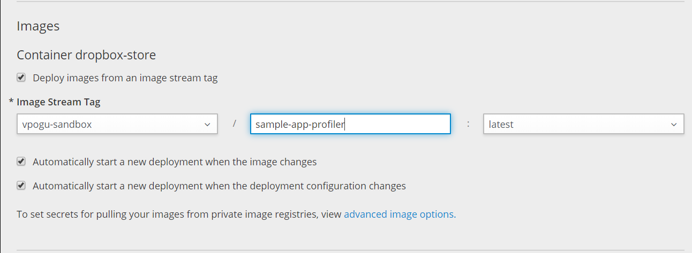

+++
title="Profiling an application in OpenShift container."
date="2019-05-14"
tags=["OpenShift", "Java", "YourKit-JavaProfiler"]
slug="javaprofiler-OpenShift"
socialShare=true
+++

Sometimes writing code that runs is not enough. We might want to know what goes on internally, such as memory allocation, consequences of using one coding approach over another, implications of concurrent executions, areas to improve performance, etc. We can use profilers for this.

In this post, I'll discuss using [YourKit-JavaProfiler](https://www.yourkit.com/) inside a container.

Since my sample application is built using OpenShift S2I process and pushed into OpenShift internal registry, I'll have to pull the image locally.

```bash
docker login -p $(oc whoami --show-token) -u admin docker-registry.example.com
docker pull docker-registry.example.com/myproject/sample-app:latest
```

Create a new Dockerfile, add a few lines to install YourKit Java Profiler agents, and expose the profiler agent port.

```Dockerfile
FROM docker-registry.example.com/myproject/sample-app:latest
RUN wget https://www.yourkit.com/download/docker/YourKit-JavaProfiler-2019.1-docker.zip -P /tmp/ && \
    unzip /tmp/YourKit-JavaProfiler-2019.1-docker.zip -d /usr/local && \
    rm /tmp/YourKit-JavaProfiler-2019.1-docker.zip
EXPOSE 10001
```

Build and push the image into the registry

```bash
docker build . -t docker-registry.example.com/myproject/sample-app-profiler:latest
docker push docker-registry.example.com/myproject/sample-app-profiler:latest
```

Update the image in the deployment configuration.



Load the agent into the JVM by adding a `JAVA_TOOL_OPTIONS` environment variable in the deployment configuration.

```bash
$ oc set env dc/MY_APP_NAME JAVA_TOOL_OPTIONS=-agentpath:/usr/local/YourKit-JavaProfiler-2019.01/bin/linux-x86-64/libyjpagent.so=port=10001,listen=all
oc rollout latest dc/MY_APP_NAME
```

Once the deployment is completed, run `oc port forwarding` from your local machine to the application pod.

```bash
$ oc get pod
NAME                            READY     STATUS      RESTARTS   AGE
MY_APP_NAME-3-1xrsp             1/1       Running     0          6s
...
$ oc port-forward MY_APP_NAME-3-1xrsp 10001:10001
```

Add a connection in the profiler with `localhost:10001,` and you're all set.
