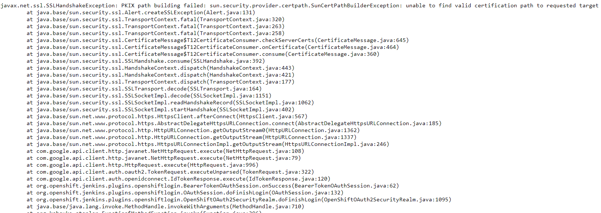

+++ 
date = 2020-02-10
title = "Jenkins OpenShift OAuth SSL"
description = "Add SSL certificates for OpenShift Jenkins Authentication using OpenShift OAuth plugin."
slug = "OpenShift-Jenkins-OAuth-SSL" 
tags = ["OpenShift", "Jenkins", "SSL"]
categories = []
externalLink = ""
series = []
socialShare=true
+++

## Jenkins SSL

### Problem

I recently encountered an issue while authenticating to OpenShift Jenkins using the OpenShift OAuth plugin, where trusted certificates provided by CA aren't included in the default JRE TrustStore.



Logs from Jenkins pod

```bash
2020-02-10 21:19:07.335+0000 [id=17]    INFO    o.o.j.p.o.OpenShiftOAuth2SecurityRealm#transportToUse: OpenShift OAuth got an SSL error when accessing the issuer's token endpoint when using the SA certificate2020-02-10 21:19:07.348+0000 [id=17]    INFO    o.o.j.p.o.OpenShiftOAuth2SecurityRealm#transportToUse: OpenShift OAuth provider token endpoint failed unexpectedly using the JVMs default keystore
sun.security.provider.certpath.SunCertPathBuilderException: unable to find valid certification path to requested target
    at java.base/sun.security.provider.certpath.SunCertPathBuilder.build(SunCertPathBuilder.java:141)
    at java.base/sun.security.provider.certpath.SunCertPathBuilder.engineBuild(SunCertPathBuilder.java:126)
    at java.base/java.security.cert.CertPathBuilder.build(CertPathBuilder.java:297)
    at java.base/sun.security.validator.PKIXValidator.doBuild(PKIXValidator.java:434)
Caused: sun.security.validator.ValidatorException: PKIX path building failed
    at java.base/sun.security.validator.PKIXValidator.doBuild(PKIXValidator.java:439)
    at java.base/sun.security.validator.PKIXValidator.engineValidate(PKIXValidator.java:306)
    at java.base/sun.security.validator.Validator.validate(Validator.java:264)
    at java.base/sun.security.ssl.X509TrustManagerImpl.validate(X509TrustManagerImpl.java:313)
    at java.base/sun.security.ssl.X509TrustManagerImpl.checkTrusted(X509TrustManagerImpl.java:222)
    at java.base/sun.security.ssl.X509TrustManagerImpl.checkServerTrusted(X509TrustManagerImpl.java:129)
    at java.base/sun.security.ssl.CertificateMessage$T12CertificateConsumer.checkServerCerts(CertificateMessage.java:629)
Caused: javax.net.ssl.SSLHandshakeException: PKIX path building failed: sun.security.provider.certpath.SunCertPathBuilderException: unable to find valid certification path to requested target
    at java.base/sun.security.ssl.Alert.createSSLException(Alert.java:131)
    at java.base/sun.security.ssl.TransportContext.fatal(TransportContext.java:320)
at java.base/sun.security.ssl.TransportContext.fatal(TransportContext.java:263)
```

### Solution

By default, Java Applications (as Jenkins) use the JVM TrustStore. Therefore, if a Java Application needs to use an additional TrustStore, it must be configured.

First, create a secret with the JKS Keystore and password.

```bash
oc create secret generic jenkins-https-jks --from-literal=https-jks-password=changeit \
--from-file=custom-keystore.jks
```

Mount `jenkins-https-jks` keystore secret as a volume to `/var/jenkins_keystore` location.

```yaml
...
        terminationMessagePath: /dev/termination-log
        terminationMessagePolicy: File
        volumeMounts:
        - mountPath: /var/lib/jenkins
          name: jenkins-data
        - mountPath: /var/jenkins_keystore
          name: jenkins-https-keystore
      serviceAccount: jenkins
      serviceAccountName: jenkins
      volumes:
      - name: jenkins-data
        persistentVolumeClaim:
          claimName: jenkins
      - name: jenkins-https-keystore
        secret:
          defaultMode: 420
          items:
          - key: custom-keystore.jks
            path: custom-keystore.jks
          secretName: jenkins-https-jks
...
```

Add the certificate to Jenkins as startup parameters; we can configure the Jenkins server to add the following JAVA properties to the `JAVA_TOOL_OPTIONS` environment variable.

```text
-Djavax.net.ssl.trustStore=/var/jenkins_keystore/custom-keystore.jks \
-Djavax.net.ssl.trustStorePassword=changeit
```

```yaml
spec:
  containers:
    - env:
      - name: JENKINS_HTTPS_KEYSTORE_PASSWORD
        valueFrom:
          secretKeyRef:
            key: https-jks-password
            name: jenkins-https-jks
      - name: JAVA_TOOL_OPTIONS
        value: -XX:+UnlockExperimentalVMOptions -Dsun.zip.disableMemoryMapping=true
            -Djavax.net.ssl.trustStore=/var/jenkins_keystore/custom-keystore.jks -Djavax.net.ssl.trustStorePassword=$(JENKINS_HTTPS_KEYSTORE_PASSWORD)
```

The final deployment config should look like this:

```yaml
apiVersion: apps.OpenShift.io/v1
kind: DeploymentConfig
metadata:
  annotations:
    template.alpha.OpenShift.io/wait-for-ready: "true"
  creationTimestamp: "2020-02-10T17:49:20Z"
  generation: 10
  labels:
    app: jenkins-persistent
  name: jenkins
spec:
  replicas: 1
  revisionHistoryLimit: 10
  selector:
    name: jenkins
  strategy:
    activeDeadlineSeconds: 21600
    recreateParams:
      timeoutSeconds: 600
    resources: {}
    type: Recreate
  template:
    metadata:
      creationTimestamp: null
      labels:
        name: jenkins
    spec:
      containers:
      - env:
        - name: OpenShift_ENABLE_OAUTH
          value: "true"
        - name: OpenShift_ENABLE_REDIRECT_PROMPT
          value: "true"
        - name: DISABLE_ADMINISTRATIVE_MONITORS
          value: "false"
        - name: KUBERNETES_MASTER
          value: https://kubernetes.default:443
        - name: KUBERNETES_TRUST_CERTIFICATES
          value: "true"
        - name: JENKINS_SERVICE_NAME
          value: jenkins
        - name: JNLP_SERVICE_NAME
          value: jenkins-jnlp
        - name: ENABLE_FATAL_ERROR_LOG_FILE
          value: "false"
        - name: JENKINS_UC_INSECURE
          value: "false"
        - name: JENKINS_HTTPS_KEYSTORE_PASSWORD
          valueFrom:
            secretKeyRef:
              key: https-jks-password
              name: jenkins-https-jks
        - name: JAVA_TOOL_OPTIONS
          value: -XX:+UnlockExperimentalVMOptions -Dsun.zip.disableMemoryMapping=true
            -Djavax.net.ssl.trustStore=/var/jenkins_keystore/custom-keystore.jks -Djavax.net.ssl.trustStorePassword=$(JENKINS_HTTPS_KEYSTORE_PASSWORD)
        image: image-registry.OpenShift-image-registry.svc:5000/OpenShift/jenkins@sha256:dd5f1c5d14a8a72aa4ca51224c26a661c2e4f19ea3e5f9b7d8343f4952de5f0d
        imagePullPolicy: IfNotPresent
        livenessProbe:
          failureThreshold: 2
          httpGet:
            path: /login
            port: 8080
            scheme: HTTP
          initialDelaySeconds: 420
          periodSeconds: 360
          successThreshold: 1
          timeoutSeconds: 240
        name: jenkins
        readinessProbe:
          failureThreshold: 3
          httpGet:
            path: /login
            port: 8080
            scheme: HTTP
          initialDelaySeconds: 3
          periodSeconds: 10
          successThreshold: 1
          timeoutSeconds: 240
        resources:
          limits:
            memory: 1Gi
        securityContext:
          capabilities: {}
          privileged: false
        terminationMessagePath: /dev/termination-log
        terminationMessagePolicy: File
        volumeMounts:
        - mountPath: /var/lib/jenkins
          name: jenkins-data
        - mountPath: /var/jenkins_keystore
          name: jenkins-https-keystore
      dnsPolicy: ClusterFirst
      restartPolicy: Always
      schedulerName: default-scheduler
      securityContext: {}
      serviceAccount: jenkins
      serviceAccountName: jenkins
      terminationGracePeriodSeconds: 30
      volumes:
      - name: jenkins-data
        persistentVolumeClaim:
          claimName: jenkins
      - name: jenkins-https-keystore
        secret:
          defaultMode: 420
          items:
          - key: custom-keystore.jks
            path: custom-keystore.jks
          secretName: jenkins-https-jks
  test: false
  triggers: []
status: {}
```

Start a new deployment.

```bash
oc rollout latest jenkins
```

Once new pods are running, login will redirect to the Jenkins home page.
