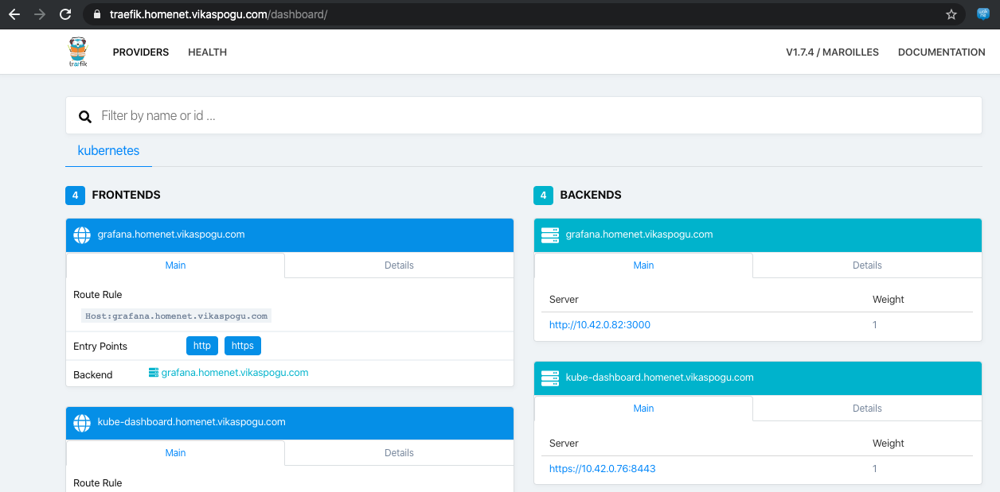

+++ 
date = 2019-12-31
title = "k3s cluster with Raspberry-Pi, Traefik"
description = "Walk through on setting up K3S cluster on raspberry pi and traefik ingress with cloudfare."
slug = "Kubernetes-home-cluster-traefik" 
tags = ["k3s","traefik","raspberry-pi"]
categories = []
externalLink = ""
series = []
socialShare=true
+++

In this post, I’ll share my home lab setup for [Rancher's k3s](https://k3s.io/) Kubernetes cluster.

Use-case:

- A web interface to be accessible outside of my home so I could check and manage devices while away
- Way to manage dynamic DNS since I don’t have a static I.P.

### Setup

- Setting up a master + single node Kubernetes cluster
- Deploying DNS updater as a Kubernetes CronJob object
- Deploying Traefik as a Kubernetes Ingress Controller and configuring it to manage SSL with Let’s Encrypt

### Setting up a Pi Kubernetes Cluster

I followed an excellent guide by Alex Ellis [here](https://blog.alexellis.io/test-drive-k3s-on-raspberry-pi/) to initialize a cluster on the master and then join a single node.

```bash
k3s kubectl get nodes
NAME        STATUS   ROLES    AGE    VERSION
pi-node1    Ready    <none>   3d     v1.16.3-k3s.2
pi-master   Ready    master   3d     v1.16.3-k3s.2
```

### DNS and Routing

- Add a DNS entry for the wildcard domain `*.home.vikaspogu.com` to point at the dynamic I.P.
- Open ports `80` and `443` on the router’s firewall

At this point, a short `dig` on the domain should return your dynamic I.P.

```bash
$ dig +short test.home.vikaspogu.com
X.X.X.X.
```

I found this script online, which will update the DNS record if Dynamic I.P. is changed.

```sh
#!/bin/sh
zone=example.com
# dnsrecord is the A record which the script will update
dnsrecord=www.example.com
EMAIL=me@cloudflare.com
API_KEY=1234567890abcdef1234567890abcdef
# Get the current external I.P. address
ip=$(dig +short <CURRENT EXTERNAL IP>)
echo "Current IP is $ip"
if host $dnsrecord 1.1.1.1 | grep "has address" | grep "$ip"; then
  echo "$dnsrecord is currently set to $ip; no changes needed."
  exit
fi
# if here, the DNS record needs updating
# get the zone id for the requested zone
zoneid=$(curl -s -X GET "https://api.cloudflare.com/client/v4/zones?name=$zone&status=active" \
  -H "X-Auth-Email: $EMAIL" \
  -H "X-Auth-Key: $API_KEY" \
  -H "Content-Type: application/json" | jq -r '{"result"}[] | .[0] | .id')
echo "Zoneid for $zone is $zoneid"
# get the DNS record id
dnsrecordid=$(curl -s -X GET "https://api.cloudflare.com/client/v4/zones/$zoneid/dns_records?type=A&name=$dnsrecord" \
  -H "X-Auth-Email: $EMAIL" \
  -H "X-Auth-Key: $API_KEY" \
  -H "Content-Type: application/json" | jq -r '{"result"}[] | .[0] | .id')
echo "DNSrecordid for $dnsrecord is $dnsrecordid"
# update the record
curl -s -X PUT "https://api.cloudflare.com/client/v4/zones/$zoneid/dns_records/$dnsrecordid" \
  -H "X-Auth-Email: $EMAIL" \
  -H "X-Auth-Key: $API_KEY" \
  -H "Content-Type: application/json" \
  --data "{\"type\":\"A\",\"name\":\"$dnsrecord\",\"content\":\"$ip\",\"ttl\":1,\"proxied\":false}" | jq
```

Create a configmap from the script, secret with Cloudflare `EMAIL` and `GLOBAL_API_TOKEN`.

```bash
$ k3s create configmap update-script --from-file=cloudfare-dns-update.sh
$ k3s kubectl create secret generic cloudflare --from-literal=email=me@cloudflare.com \
--from-literal=api_key=1234567890abcdef1234567890abcdef
```

Now create a Kubernetes cronjob to update the DNS record to the correct address.

```yaml
apiVersion: batch/v1beta1
kind: CronJob
metadata:
  name: dns-update
  namespace: default
spec:
  schedule: "0 0 * * *"
  concurrencyPolicy: Forbid
  jobTemplate:
    spec:
      template:
        spec:
          restartPolicy: OnFailure
          containers:
            - name: dns-update
              image: e2eteam/dnsutils:1.1-linux-arm
              command: ["/bin/sh", "-c", "/scripts/cloudfare-dns-update.sh"]
              env:
                - name: API_KEY
                  valueFrom:
                    secretKeyRef:
                      name: cloudflare
                      key: api_key
                - name: EMAIL
                  valueFrom:
                    secretKeyRef:
                      name: cloudflare
                      key: email
              volumeMounts:
                - name: config-volume
                  mountPath: /scripts
          volumes:
            - name: config-volume
              configMap:
                name: update-script
                defaultMode: 0744
```

### Traefik and Let’s Encrypt

With a functioning cluster and the networking setup complete, the next task is to deploy a reverse proxy to manage the application routing.

In Kubernetes, we can deploy an Ingress Controller to achieve this. An Ingress Controller implements a reverse proxy that listens for changes to KubernetesIngress resources and updates its configuration accordingly.

Traefik provides detailed [instructions](https://docs.traefik.io/v1.7/user-guide/kubernetes/) on Kubernetes implementation, but I customized it slightly to get things working with my setup.

First, create RoleBinding.

```bash
k3s kubectl apply -f https://raw.githubusercontent.com/containous/traefik/v1.7/examples/k8s/traefik-rbac.yaml
```

Configure Let’s Encrypt to support HTTPS endpoint and automatically fetch certificates. I used Cloudflare as the DNS provider, configuring Traefik to use DNS records for domain validation.

```yaml
[acme]
    email = "me@cloudflare.com"
    storage="./acme.json"
    entryPoint = "https"
    acmeLogging=true
    [acme.dnsChallenge]
      provider = "cloudflare"
      delayBeforeCheck = 0
    [[acme.domains]]
      main = "*.home.vikaspogu.com"
      sans = ["home.vikaspogu.com"]
```

The Deployment objects look like this:

```yaml
apiVersion: v1
data:
  traefik.toml: |
    # traefik.toml
    logLevel = "info"
    debug = true
    insecureSkipVerify = true
    defaultEntryPoints = ["http","https"]
    [entryPoints]
      [entryPoints.http]
      address = ":80"
        [entryPoints.http.redirect]
        entryPoint = "https"
      [entryPoints.https]
      address = ":443"
        [entryPoints.https.tls]
    [api]
      dashboard = true
    [kubernetes]
    [acme]
    email = "me@cloudflare.com"
    storage="./acme.json"
    entryPoint = "https"
    acmeLogging=true
    [acme.dnsChallenge]
      provider = "cloudflare"
      delayBeforeCheck = 0
    [[acme.domains]]
      main = "*.home.vikaspogu.com"
      sans = ["home.vikaspogu.com"]
kind: ConfigMap
metadata:
  labels:
    app: traefik
  name: traefik-config
  namespace: default
---
apiVersion: v1
kind: ServiceAccount
metadata:
  namespace: default
  name: traefik-ingress-controller
  labels:
    app: traefik
---
kind: Deployment
apiVersion: apps/v1
metadata:
  namespace: default
  name: traefik
  labels:
    app: traefik
spec:
  replicas: 1
  selector:
    matchLabels:
      app: traefik
  template:
    metadata:
      labels:
        app: traefik
    spec:
      serviceAccountName: traefik-ingress-controller
      containers:
        - name: traefik
          image: traefik:1.7.4
          ports:
            - name: http
              containerPort: 80
            - name: https
              containerPort: 443
            - name: admin
              containerPort: 8080
          env:
            - name: CF_API_EMAIL
              valueFrom:
                secretKeyRef:
                  name: cloudflare
                  key: email
            - name: CF_API_KEY
              valueFrom:
                secretKeyRef:
                  name: cloudflare
                  key: api_key
          volumeMounts:
            - mountPath: "/config"
              name: "config"
          args:
            - --configfile=/config/traefik.toml
      volumes:
        - name: config
          configMap:
            name: traefik-config
---
kind: Service
apiVersion: v1
metadata:
  name: traefik-ingress-service
  namespace: default
spec:
  selector:
    app: traefik
  ports:
    - protocol: TCP
      port: 80
      name: http
    - protocol: TCP
      port: 443
      name: https
    - protocol: TCP
      port: 8080
      name: admin
  externalIPs:
    - 192.168.0.101 # This is the node address
```

Deploy Ingress controller for traefik dashboard.

```yaml
---
apiVersion: extensions/v1beta1
kind: Ingress
metadata:
  name: traefik-web-ui
  namespace: default
spec:
  rules:
    - host: traefik.home.vikaspogu.com
      http:
        paths:
          - path: /
            backend:
              serviceName: traefik-ingress-service
              servicePort: admin
```

Voila!



### Deploy Kubernetes dashboard

Follow these instructions to [deploy dashboard U.I.](https://kubernetes.io/docs/tasks/access-application-cluster/web-ui-dashboard/).

Create an ingress controller to access the dashboard.

```yaml
---
apiVersion: extensions/v1beta1
kind: Ingress
metadata:
  name: kubernetes-dashboard-ingress
  namespace: kubernetes-dashboard
spec:
  rules:
    - host: kubernetes-dashboard.home.vikaspogu.com
      http:
        paths:
          - backend:
              serviceName: kubernetes-dashboard
              servicePort: 443
```
