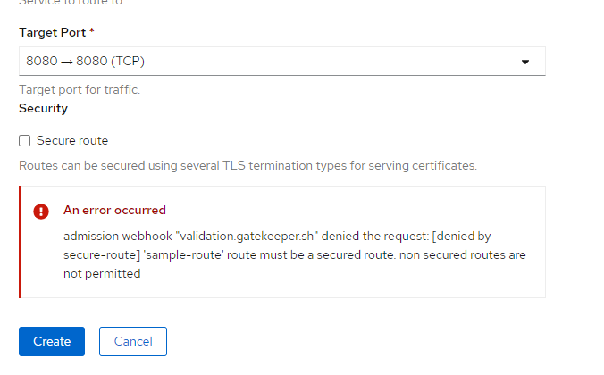

+++ 
date = 2020-08-18
title = "OPA Gatekeeper on OpenShift"
description = "OpenShift policy management with OPA gatekeeper."
slug = "OPA-gatekeeper-OpenShift" 
tags = ["OpenShift", "OPA", "gatekeeper"]
categories = []
externalLink = ""
series = []
socialShare=true
+++

Every organization has policies. Some are essential to meet governance and legal requirements. Others help ensure adherence to best practices and institutional conventions. Attempting to ensure compliance manually would be error-prone and frustrating.

OPA allows users to a specific policy as code using OPA's policy language [Rego](https://www.openpolicyagent.org/docs/latest/policy-language/)

In this post, I'll share my experience deploying OPA [Gatekeeper](https://github.com/open-policy-agent/gatekeeper) on OpenShift and creating a few policies for demonstrations. This post is not an introduction to OPA [refer to](https://www.magalix.com/blog/introducing-policy-as-code-the-open-policy-agent-opa) for an intro

Gatekeeper introduces native Kubernetes CRDs for instantiating policies.

## Installation

For installation, make sure you have cluster-admin permissions.

Let's start by adding the `admission.gatekeeper.sh/ignore` label to non-user namespaces so that all the resources in the labeled project are exempted from the admission webhook.

```bash
oc login --token=l4xjpLh0e722B2_i7iWAbPsUNOb6vPDaAXnqhH563oU --server=https://api.cluster-1d4d.sandbox702.opentlc.com:6443

for namespace in $(oc get namespaces -o jsonpath='{.items[*].metadata.name}' | xargs); do
  if [[ "${namespace}" =~ OpenShift.* ]] || [[ "${namespace}" =~ kube.* ]] || [[ "${namespace}" =~ default ]]; then
    oc patch namespace/${namespace} -p='{"metadata":{"labels":{"admission.gatekeeper.sh/ignore":"true"}}}'
  else
    # Probably a user project, so leave it alone
    echo "Skipping: ${namespace}"
  fi
done
```

### Deploying a Release using Prebuilt Image

Deploy Gatekeeper with a prebuilt image

```bash
oc apply -f https://raw.githubusercontent.com/open-policy-agent/gatekeeper/master/deploy/gatekeeper.yaml
```

Remove securityContext and annotations from the deployments.

```bash
oc patch Deployment/gatekeeper-audit --type json -p='[{"op": "remove", "path": "/spec/template/metadata/annotations"}]' -n gatekeeper-system
oc patch Deployment/gatekeeper-controller-manager --type json -p='[{"op": "remove", "path": "/spec/template/metadata/annotations"}]' -n gatekeeper-system
oc patch Deployment/gatekeeper-audit --type json --patch '[{ "op": "remove", "path": "/spec/template/spec/containers/0/securityContext" }]' -n gatekeeper-system
oc patch Deployment/gatekeeper-controller-manager --type json --patch '[{ "op": "remove", "path": "/spec/template/spec/containers/0/securityContext" }]' -n gatekeeper-system
```

Wait for Gatekeeper to be ready.

```bash
oc get pods -n gatekeeper-system
NAME                                            READY   STATUS    RESTARTS   AGE
gatekeeper-audit-7c84869dbf-r5p87               1/1     Running   0          2m34s
gatekeeper-controller-manager-ff58b6688-9tbxx   1/1     Running   0          3m23s
gatekeeper-controller-manager-ff58b6688-njfnd   1/1     Running   0          2m54s
gatekeeper-controller-manager-ff58b6688-vlrsl   1/1     Running   0          3m11s
```

Gatekeeper uses the [OPA Constraint Framework](https://github.com/open-policy-agent/frameworks/tree/master/constraint) to describe and enforce policy

### Defining constraints

Users can define constraints by creating a CRD (CustomResourceDefinition) with the template of the constraint they want. For example, let’s look at a template that only enforces users must create secure routes on the cluster.

```yaml
apiVersion: templates. Gatekeeper.sh/v1beta1
kind: ConstraintTemplate
metadata:
  name: k8sallowedroutes
spec:
  crd:
    spec:
      names:
        kind: K8sAllowedRoutes
  targets:
    - target: admission.k8s.gatekeeper.sh
      rego: |
        package k8sallowedroutes

        violation[{"msg": msg}] {
          not input.review.object.spec.tls
          msg := sprintf("'%v' route must be a secured route. non secured routes are not permitted", [input.review.object.metadata.name])
        }
```

It will get the route and check if the `tls` object is specified. If this is not true, the violation block continues, and the violation is triggered with the corresponding message.

### Enforcing constraints

Define a template using earlier constraints to enforce.

```yaml
apiVersion: constraints. Gatekeeper.sh/v1beta1
kind: K8sAllowedRoutes
metadata:
  name: secure-route
spec:
  match:
    kinds:
      - apiGroups: ["route.OpenShift.io"]
        kinds: ["Route"]
```

The above policy uses the CRD “K8sAllowedRoutes”, which we had already defined. Enforcement takes place by matching the API group.



Some constraints are impossible to write without access to more states than the object under test. For example, it is impossible to know if a route's hostname is unique among all routes unless a rule has access to all other routes. To make such laws possible, we enable syncing of data into OPA.

```yaml
apiVersion: config. Gatekeeper.sh/v1alpha1
kind: Config
metadata:
  name: config
  namespace: "gatekeeper-system"
spec:
  sync:
    syncOnly:
      - group: ""
        version: "v1"
        kind: "Namespace"
      - group: "route.OpenShift.io"
        version: "v1"
        kind: "Route"
```

Let's create another policy that prevents conflicting routes from being created.

```yaml
apiVersion: templates. Gatekeeper.sh/v1beta1
kind: ConstraintTemplate
metadata:
  name: k8suniqueroutehost
spec:
  crd:
    spec:
      names:
        kind: K8sUniqueRouteHost
  targets:
    - target: admission.k8s.gatekeeper.sh
      rego: |
        package k8suniqueroutehost

        identical(obj, review) {
          obj.metadata.namespace == review.object.metadata.namespace
          obj.metadata.name == review.object.metadata.name
        }

        violation[{"msg": msg}] {
          input.review.kind.kind == "Route"
          re_match("^(route.OpenShift.io)$", input.review.kind.group)
          host := input.review.object.spec.host
          other := data.inventory.namespace[ns][otherapiversion]["Route"][name]
          re_match("^(route.OpenShift.io)/.+$", otherapiversion)
          other.spec.host == host
          not identical(other, input.review)
          msg := sprintf("Route host conflicts with an existing route <%v>", [host])
        }
```

```yaml
apiVersion: constraints. Gatekeeper.sh/v1beta1
kind: K8sUniqueRouteHost
metadata:
  name: unique-route-host
spec:
  match:
    kinds:
      - apiGroups: ["route.OpenShift.io"]
        kinds: ["Route"]
```

## Resources

- [Open Policy Agent](https://www.openpolicyagent.org/docs/latest/)
- [OPA Gatekeeper](https://github.com/open-policy-agent/gatekeeper)
- [Test framework](https://github.com/open-policy-agent/conftest)
