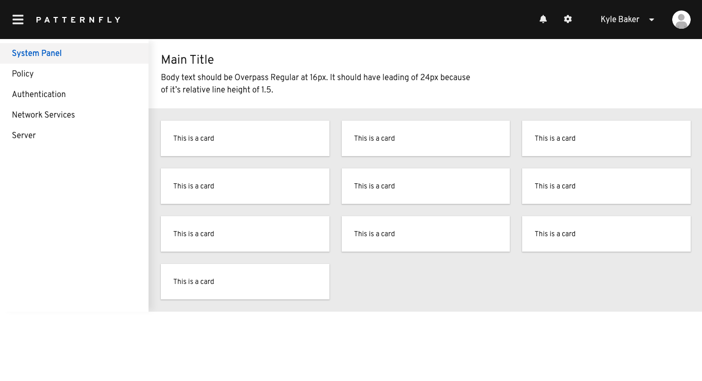

> **Note:** This post references PatternFly v4. PatternFly is now at v5+ with significant API changes. See the [PatternFly documentation](https://www.patternfly.org/) for current installation and usage guides.

To integrate [PatternFly](https://www.patternfly.org/) framework into a React application, create a new project or use an existing one

```bash
npx create-react-app patternfly-setup-react
```

Install patternfly dependencies `react-core`, `react-table` and `patternfly`

```bash
npm i --save @patternfly/patternfly \
  @patternfly/react-core @patternfly/react-table
```

**Note:** Import `base.css` and `patternfly.css` in your project, or some components may diverge in appearance

```javascript
//These imports are a must to render CSS
import "@patternfly/react-core/dist/styles/base.css";
import "@patternfly/patternfly/patternfly.css";
```

To make sure everything is working correctly, update `App.js` with a demo layout from [documentation](https://www.patternfly.org/v4/documentation/react/demos/)

```javascript
import React from "react";
import {
  Avatar,
  Brand,
  Button,
  ButtonVariant
  ...
  ...
} from "@patternfly/react-core";
import accessibleStyles from "@patternfly/react-styles/css/utilities/Accessibility/accessibility";
import spacingStyles from "@patternfly/react-styles/css/utilities/Spacing/spacing";
import { css } from "@patternfly/react-styles";
import { BellIcon, CogIcon } from "@patternfly/react-icons";

//These imports are a must to render CSS
import "@patternfly/react-core/dist/styles/base.css";
import "@patternfly/patternfly/patternfly.css";

class App extends React.Component {
...
...
    return (
      <React.Fragment>
        <Page
          header={Header}
          sidebar={Sidebar}
          isManagedSidebar
          skipToContent={PageSkipToContent}
        >
        <PageSection variant={PageSectionVariants.light}>
            <TextContent>
              <Text component="h1">Main Title</Text>
              <Text component="p">
                Body text should be Overpass Regular at 16px. It should have leading of 24px because <br />
                of its relative line height of 1.5.
              </Text>
            </TextContent>
          </PageSection>
          <PageSection>
            <Gallery gutter="md">
              {Array.apply(0, Array(10)).map((x, i) => (
                <GalleryItem key={i}>
                  <Card>
                    <CardBody>This is a card</CardBody>
                  </Card>
                </GalleryItem>
              ))}
            </Gallery>
            </PageSection>
        </Page>
      </React.Fragment>
    );
  }
}
export default App;
```

Start the application

```bash
npm start
```

You should see a patternfly design like this!


