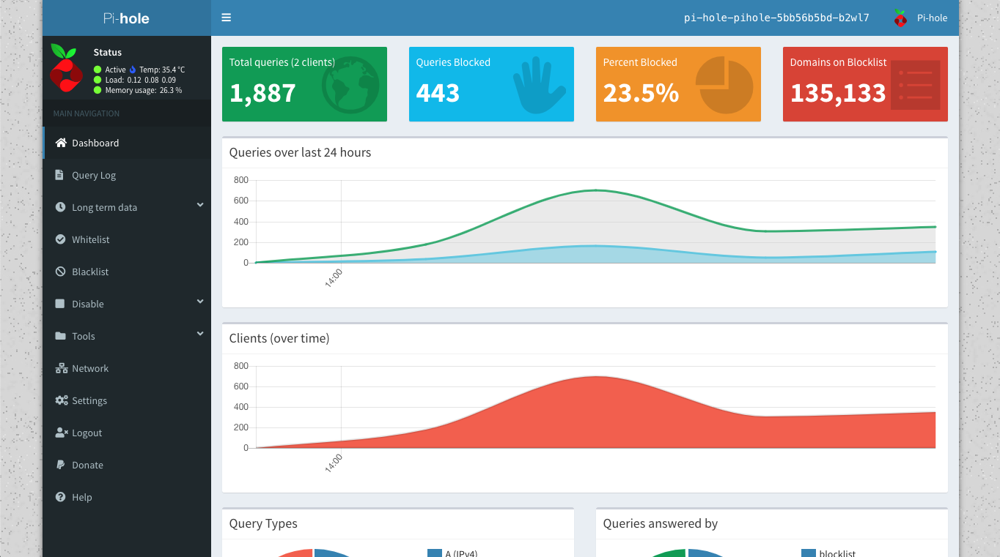

+++ 
date = 2020-03-07
title = "Pi Hole on k3s cluster"
description = "Deploying Pi-Hole on k3s cluster."
slug = "pi-hole-Kubernetes" 
tags = ["pi-hole","k3s"]
categories = []
externalLink = ""
series = []
socialShare=true
+++

[Pi-hole](https://pi-hole.net/) is a fantastic tool that blocks DNS requests to ad servers. That means you can surf the web without looking at ads on every page.

## Pi-Hole in Kubernetes

We are going to deploy a modified version of this [pihole helm chart](https://github.com/ChrisPhillips-cminion/pihole-helm)

Let's start by cloning the repo.

```bash
git clone https://github.com/ChrisPhillips-cminion/pihole-helm.git
cd pihole-helm
```

We now need to make a few updates to the chart.

- Update `ServerIP` with container host IP
- Update image to `v5.1.1` tag
- Add `WEB_PASSWORD`, and `TZ` environment variables if needed
- Update `values.yaml` accordingly

```yaml
spec:
  replicas: 1
  template:
    metadata:
      labels:
        app: {{ template "fullname" . }}
    spec:
      # hostNetwork: true
      hostAliases:
      - ip: 127.0.0.1
        hostnames:
        - pi.hole
      nodeSelector:
        kubernetes.io/hostname: randomstore
      containers:
      - name: {{ .Chart.Name }}
        image: pihole/pihole:v5.1.1
        imagePullPolicy: {{ .Values.image.pullPolicy }}
        stdin: true
        tty: true
        resources:
          limits:
            memory: 1Gi
        env:
        - name: 'ServerIP'
          value: '192.168.1.132'
        - name: 'DNS1'
          value: '8.8.8.8'
        - name: 'DNS2'
          value: '8.8.4.4'
    - name: TZ
      value: "America/New_York"
    - name: WEBPASSWORD
      value: "somepassword"
```

```yaml
#values.yaml
configData: |-
  server=/local/192.168.1.1
  address=/.vikaspogu.com/192.168.1.132
ingress:
  host: pi-hole.vikaspogu.com
```

### Install chart

- Create a new namespace (optional)
- Install chart in namespace

```bash
kubectl create ns pi-hole
helm install pi-hole.
```

- Wait for pods

```bash
kubectl get pods
NAME                             READY   STATUS    RESTARTS   AGE
pi-hole-pihole-5bb56b5bd-b2wl7   1/1     Running   0          61m
```

- Navigate to the ingress route in my case (pi-hole.vikaspogu.com) and log in with `WEBPASSWORD` used in the deployment



### DNS Server

Configure `Verizon FiOS` router to use Pi-Hole as the DNS server:

- On the top navigation menu

  - Click My Network

- On the left menu list

  - Click Network Connections

- Click Broadband Connection (Ethernet/Coax)>Settings

  - Click the drop-down for DNS Server and select "Use The Following DNS Server Addresses"

  - Type in the static IP Address of your pi (Or Pi-hole server)

  - Click Apply
