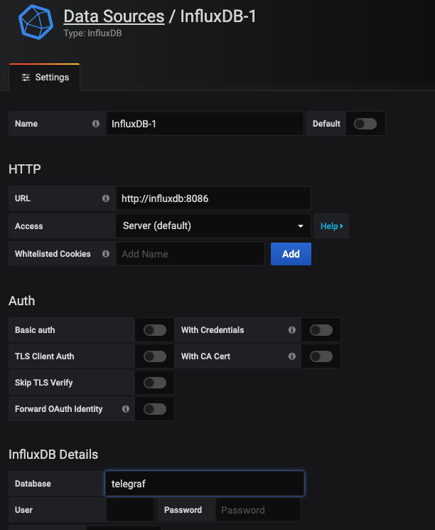
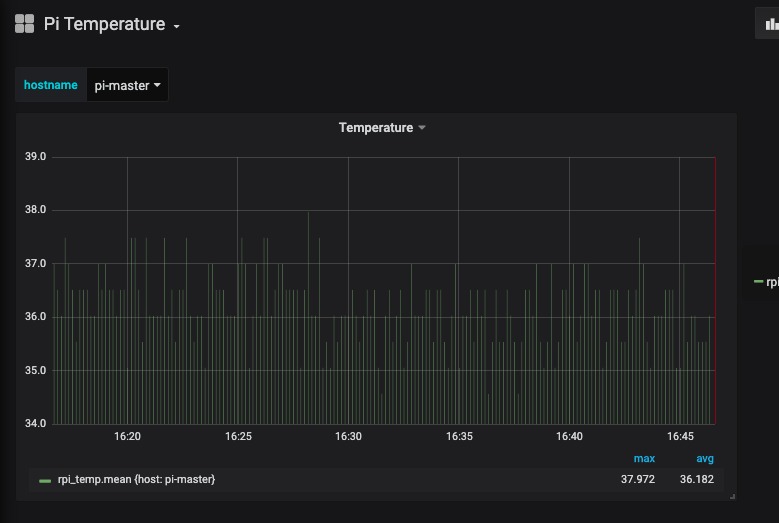

+++ 
date = 2020-01-01
title = "Measure Raspberry Pi temperature using Telegraf, Influxdb, Grafana on k3s"
description = "Measure Raspberry Pi temperature using Telegraf, Influxdb, Grafana on k3s."
slug = "raspberry-pi-temp-telegraf" 
tags = ["k3s","grafana","influxdb","telegraf"]
categories = []
externalLink = ""
series = []
socialShare=true
+++

In my previous post, I went through the k3s cluster home setup. Now, I'll show how to measure the temperature of those Raspberry Pi's using Telegraf, Influxdb, Grafana, and Helm charts.

## Why Telegraf?

Telegraf has a plugin called [exec](https://github.com/influxdata/telegraf/tree/master/plugins/inputs/exec), which can execute the commands on the host machine at a specific interval and parses those metrics from their output in any one of the accepted input data formats.

First, deploy the `influxdb` time series database chart.

```yaml
apiVersion: helm.cattle.io/v1
kind: HelmChart
metadata:
  name: influxdb
  namespace: kube-system
spec:
  chart: stable/influxdb
  targetNamespace: monitoring
```

### Get Pi temperature

I found this one-liner `/sys/class/thermal/thermal_zone0/temp`, which returns the temperature of the Pi; divide the output by 1000 to get a result in °C and use `awk` to have a float value.

```bash
awk '{print $1/1000}' /sys/class/thermal/thermal_zone0/temp
```

### Update Chart values

Update chart values, add `[inputs.exec]` to config, and deploy it

```yaml
apiVersion: helm.cattle.io/v1
kind: HelmChart
metadata:
  name: telegraf
  namespace: kube-system
spec:
  chart: stable/telegraf
  targetNamespace: monitoring
  valuesContent: |-
    replicaCount: 2
    image:
      repo: "telegraf"
      tag: "latest"
      pullPolicy: IfNotPresent
    env:
    - name: HOSTNAME
      valueFrom:
        fieldRef:
          fieldPath: spec.nodeName
    config:
      inputs:
        - exec:
            commands: ["awk '{print $1/1000}' /sys/class/thermal/thermal_zone0/temp"]
            name_override: "rpi_temp"
            data_format: "value"
            data_type: "float"
```

### Add Datasource

Once influxdb and telegraf pods are ready, add influxdb Datasource in grafana.



### Grafana

For Grafana visualization, import [this](https://gist.github.com/Vikaspogu/b2d2f04e3102d65deb1ce6913f126e57) dashboard.


