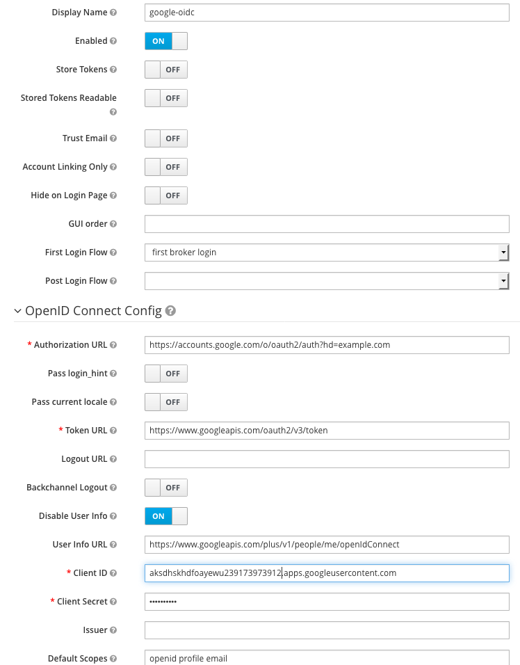
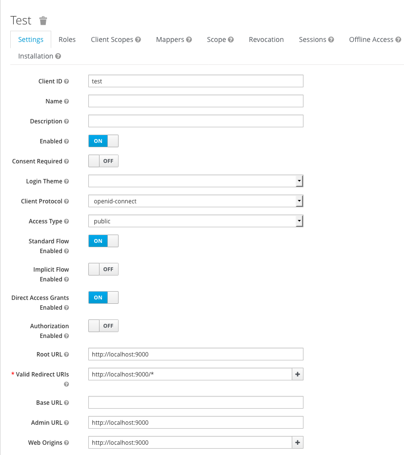
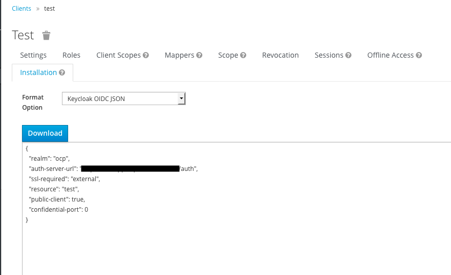

+++
title= "React App with RedHat SSO or keycloak"
date= "2019-07-25"
tags= ["RedHat SSO", "React", "keycloak"]
slug="redhat-sso-react"
socialShare=true
+++

This post will show you how to secure a React app using RedHat SSO (upstream Keycloak). In this case, `OpenID-connect` is my identity provider.



Install the official Keycloak js adapter

```bash
npm i keycloak-js --save
```

Add host and port information to the client; in my case, it's `localhost:9000`



In App.js, add a JavaScript object with the required configuration; you will find these configurations under `Clients`->`Installation`.

```javascript
//keycloak init options
const initOptions = {
  url: "https://localhost:8080/auth",
  realm: "test",
  clientId: "react-app",
  onLoad: "login-required"
};
```



By default, to authenticate, you need to call the login function. However, there are two options available to make the adapter automatically authenticate. First, you can pass `login-required` or `check-sso` to the init function. 
`login-required` will authenticate the client if the user is logged-in to `{project_name}` or display the login page if not. 
`check-sso` will only authenticate the client if the user is already logged-in; if the user is not logged in, the browser will be redirected back to the application and remain unauthenticated.

```javascript
componentDidMount() {
    let keycloak = Keycloak(initOptions);
    keycloak.init({ onLoad: initOptions.onLoad }).success(authenticated => {});
}
```

Finally

```javascript
import * as Keycloak from "keycloak-js";

//keycloak init options
const initOptions = {
  url: "https://localhost:8080/auth",
  realm: "test",
  clientId: "react-app",
  onLoad: "login-required"
};

class App extends React.Component {
  constructor(props) {
    super(props);
    this.state = {
      keycloak: null,
      authenticated: false
    };
  }
  componentDidMount() {
    let keycloak = Keycloak(initOptions);
    keycloak.init({ onLoad: initOptions.onLoad }).success(authenticated => {
      this.setState({ keycloak: keycloak, authenticated: authenticated });
    });
  }
  render() {
    const { keycloak, authenticated } = this.state;
    if (keycloak) {
      if (authenticated) {
        return (
          <React.Fragment>
            <AppRouter />
          </React.Fragment>
        );
      }
    }
    return <div>Initializing SS0...</div>;
  }
}
```

Run your app

```bash
$ npm run start
```

Navigate to `http://localhost:9000`; you should see the login page if the user is not authenticated.
