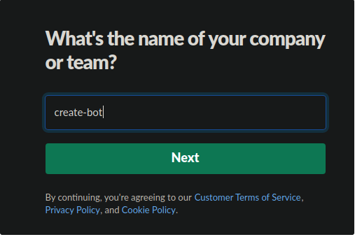
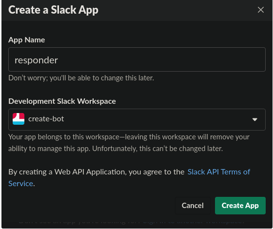
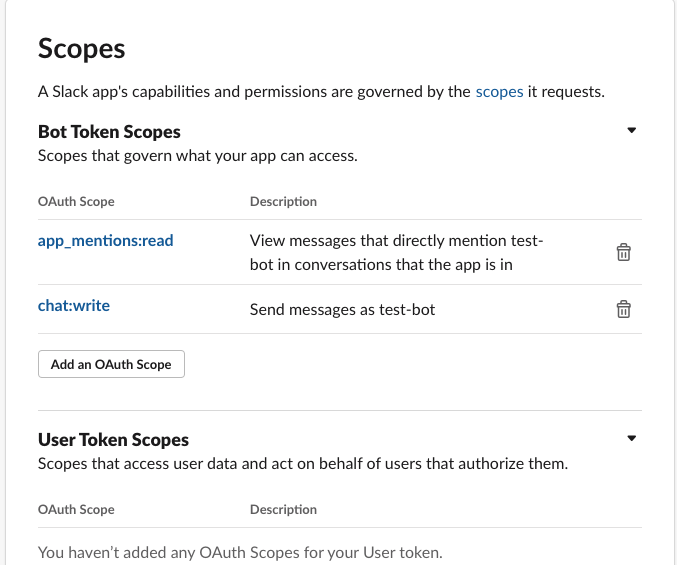
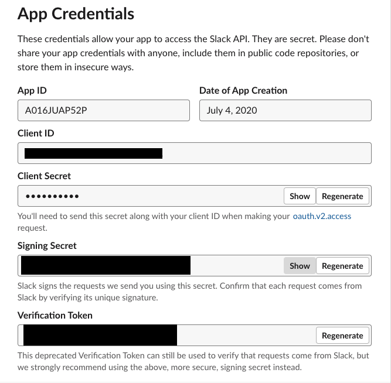
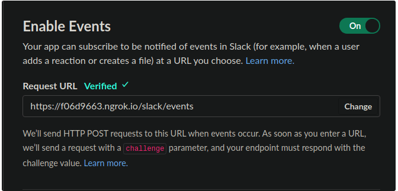
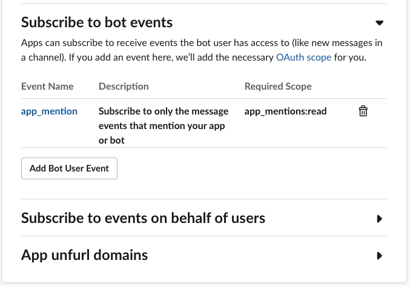
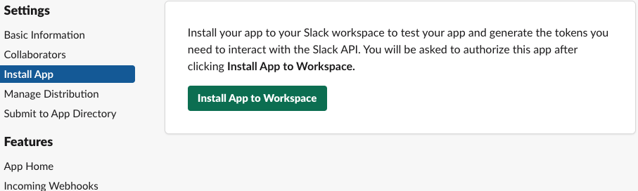
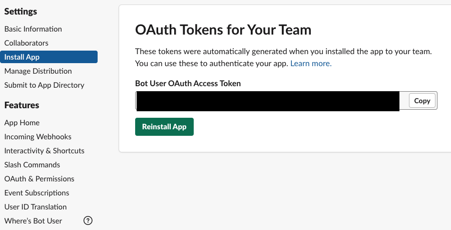

+++ 
date = 2020-07-04
title = "Slack bot with Nodejs"
description = "Building a slack bot using bolt library in NodeJS"
slug = "nodejs-slack-bot" 
tags = ["slack-bot", "NodeJS"]
categories = []
externalLink = ""
series = []
socialShare=true
+++

Build your slack bot in a few steps. In this post, we'll navigate the process of creating the bot.

## Slack setup

First, create a slack [workspace](https://slack.com/intl/en-ng/create#email)

- Give your workspace a name



Create a new bot at [slack apps](https://api.slack.com/apps)

- Give your new application a name
- Choose the workspace you created before installing the bot application



Then go to the `Features > OAuth & Permissions` screen to scroll down to `Bot Token Scopes` to specify the OAuth scopes, and select `app_mentions` and `chat_write` to enable the bot to send messages.



Before jumping into the application setup, copy the signing secret and verification token from the basic information page. We'll be using this later in our NodeJS application.



## Application setup

Create an npm project, install `@slack/bolt` and `dotenv` packages

```bash
mkdir test-bot && cd test-bot
npm init -y
npm i dotenv @slack/bolt -S
```

Add start command to scripts if necessary.

```json
...
"scripts": {
  "start": "node index.js"
}
```

Create a `.env` file and add `SLACK_SIGNING_SECRET`, `SLACK_BOT_TOKEN`

**Note:** Don't commit this file to any repo

```env
SLACK_BOT_TOKEN= #token goes here
SLACK_SIGNING_SECRET= #signing secret goes here
```

In your index.js file, require the Bolt package, and initialize an app with credentials.

```javascript
require("dotenv").config();
const { App } = require("@slack/bolt");

const bot = new App({
  signingSecret: process.env.SLACK_SIGNING_SECRET,
  token: process.env.SLACK_BOT_TOKEN,
  endpoints: "/slack/events",
});

(async () => {
  // Start the app
  await bot.start(process.env.PORT || 3000);

  console.log("⚡️ Bolt app is running!");
})();
```

Deploy the application to a live server like `ngrok`.

#### Event Setup

We'll need to subscribe to events so that when a Slack event happens (like a user mentions an app), the app server will receive an event payload.

- Go to Event Subscriptions from the left-hand menu, and turn the toggle switch on to enable events

- Enter your Request URL



Subscribe to `app_mention` event



Install app to workspace



You should see the bot in your workspace now!

#### Handling Events

To listen to any Events API events from Slack, use the event() method. This method allows your app to take action on Slack events. In this scenario, it's triggered when a user mentions the app.

```javascript
bot.event("app_mention", async ({ context, event }) => {
  try {
    const command = event.text;
    let reply;
    if (command.includes("Hi")) {
      reply = `Hi <@${event.user}>,  you mentioned me`;
    } else {
      reply = "How can I help you?";
    }
    await bot.client.chat.postMessage({
      token: context.botToken,
      channel: event.channel,
      text: `${reply}`,
    });
  } catch (e) {
    console.log(`error responding ${e}`);
  }
});
```

Okay, let's try the app!

Add the app to a channel and mention the app. You should see a response from the bot!

### Troubleshooting

Reinstall the app if you don't see any responses from the bot


