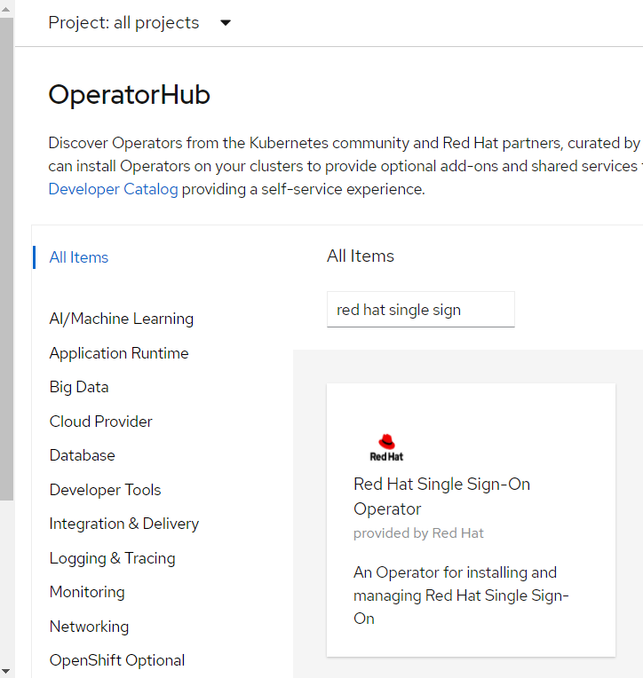

+++ 
date = 2020-11-12
title = "End User Auth and Authz with OpenShift Service Mesh and Keycloak"
description = "End User Authentication and Authorization with OpenShift Service Mesh and Keycloak"
slug = "servicemesh-jwt-auth-authz-keycloack" 
tags = ["istio", "service mesh", "keycloak", "jwt", "authentication", "authorization"]
categories = []
externalLink = ""
series = []
socialShare=true
+++

In this article, I will share the setup for enabling Authentication and Authorization in OpenShift Service Mesh with Keycloak.

## Installing OpenShift Service Mesh

Follow the [Installing Red Hat OpenShift Service Mesh](https://docs.OpenShift.com/container-platform/4.6/service_mesh/v1x/installing-ossm.html) guide for setup

Enable the following configuration in your `ServiceMeshControlPlane` resource

- Strict mTLS across the mesh
- Automatic istio route creation

```yaml
apiVersion: maistra.io/v2
kind: ServiceMeshControlPlane
spec:
  version: v1.1
  security:
    controlPlane:
      mtls: true
  gateways:
    OpenShiftRoute:
      enabled: true
```

## Keycloak

Keycloak is an open-source identity and access management application that uses open protocols and is easily integrated with other providers. It is the open-source project base of Red Hat Single Sign-on

### Deploying Red Hat Single Sign-on

The easiest way to deploy SSO is from the operator hub.



Follow the [Keycloak identity provider](https://labs.consol.de/development/2020/05/07/istio-and-keycloak.html) article for adding a new security realm, client, role, user

### Deploying Bookinfo example application

Create a new namespace

```bash
oc new-project bookinfo
```

Edit the default Service Mesh Member Roll YAML and add bookinfo to the member's list

```yaml
apiVersion: maistra.io/v1
kind: ServiceMeshMemberRoll
metadata:
  name: default
spec:
  members:
  - bookinfo
```

From the CLI, deploy the Bookinfo application in the `bookinfo` project by applying the bookinfo.yaml file

```bash
oc apply -n bookinfo -f https://raw.githubusercontent.com/Maistra/istio/maistra-2.0/samples/bookinfo/platform/kube/bookinfo.yaml
```

Create the ingress gateway by applying the bookinfo-gateway.yaml file

```bash
oc apply -n bookinfo -f https://raw.githubusercontent.com/Maistra/istio/maistra-2.0/samples/bookinfo/networking/bookinfo-gateway.yaml
```

Set the value for the `GATEWAY_URL` parameter

```bash
oc get routes -n istio-system | grep bookinfo
export GATEWAY_URL=$(oc -n istio-system get route bookinfo-gateway-pl2rw -o jsonpath='{.spec.host}')
```

Adding default destination rules

I have enabled global mutual TLS in the control plane, so I’ll deploy the destination rule with all mtls

```bash
oc apply -n bookinfo -f https://raw.githubusercontent.com/Maistra/istio/maistra-2.0/samples/bookinfo/networking/destination-rule-all-mtls.yaml
```

Verifying the Bookinfo installation

Run the following command to confirm that the Bookinfo application is up and running

```bash
curl -o /dev/null -s -w "%{http_code}\n" http://$GATEWAY_URL/productpage
```

## Authentication

### Enabling User-End Authentication

Now it is time to enable end-user authentication.

The first thing you need to do is validate that it is possible to communicate between all services without authentication.

```bash
curl -k -o /dev/null -w "%{http_code}" http://$GATEWAY_URL/productpage
200
```

You can create the end-user authentication policy.

```bash
cat <<EOF | oc apply -n bookinfo -f -
apiVersion: authentication.istio.io/v1alpha1
kind: Policy
metadata:
  name: "productpage-jwt"
  namespace: "bookinfo"
spec:
  targets:
    - name: productpage
  peers:
    - mtls: {}
  origins:
    - jwt:
        issuer: "https://keycloak-sso.apps.amp01.lab.amp.aapaws/auth/realms/istio"
        jwksUri: "https://keycloak-sso.apps.amp01.lab.amp.aapaws/auth/realms/istio/protocol/openid-connect/certs"
        audiences:
          - customer
        triggerRules:
          - excludedPaths:
              - prefix: /healthz
  principalBinding: USE_ORIGIN
EOF
```

**NOTE**: If you see `Origin authentication failed.` after passing the correct access token and URL. Verify your istio-pilot pods for any `x509: certificate signed by unknown authority`; if that is the case, follow this [workaround](https://labs.consol.de/development/2020/05/07/debugging-istio.html)

Then let’s rerun the curl.

```bash
curl -k http://$GATEWAY_URL/productpage
```

And you will see something like

```bash
Origin authentication failed.
```

Set the value for the `TOKEN` parameter from keyclock

```bash
export TOKEN=$(curl -sk --data "username=demo&password=demo&grant_type=password&client_id=istio" https://keycloak-sso.apps.amp01.lab.amp.aapaws/auth/realms/istio/protocol/openid-connect/token | jq ".access_token")
```

Then let’s rerun the curl, this time with the token.

```bash
curl -k -o /dev/null -w "%{http_code}" -H "Authorization: Bearer $TOKEN" http://$GATEWAY_URL/productpage
200
```

## Authorization

Create a deny-all policy in the namespace. The policy doesn’t have a selector field, which applies to every workload in the namespace. The `spec: field` in the policy has the empty value {}, this means that no traffic is permitted, effectively denying all requests

```bash
$ cat <<EOF | oc apply -n bookinfo -f -
apiVersion: security.istio.io/v1beta1
kind: AuthorizationPolicy
metadata:
  name: deny-all
spec:
  {}
EOF
```

Once the policy takes effect, verify that mesh rejected the curl connection to the workload.

```bash
$ curl -k -H "Authorization: Bearer $TOKEN" http://$GATEWAY_URL/productpage
RBAC: access denied
```

To give read access to the product page workload, create the policy that applies to the workload with label app: product page and allows users with roles customer to access it with all method.

```bash
$ cat <<EOF | oc apply -n bookinfo -f -
apiVersion: security.istio.io/v1beta1
kind: AuthorizationPolicy
metadata:
  name: "productpage-authz"
  namespace: "bookinfo"
spec:
  selector:
    matchLabels:
      app: productpage
  rules:
    - to:
        - operation:
            methods: ["*"]
      when:
        - key: request.auth.claims[roles]
          values: ["customer"]
EOF
```

Wait for the newly defined policy to take effect.

After the policy takes effect, verify the connection to the httpbin workload succeeds.

```bash
curl -k  -o /dev/null -w "%{http_code}" -H "Authorization: Bearer $TOKEN" http://$GATEWAY_URL/productpage
200
```

However, you can see the following errors on the page.

- Error fetching product details
- Error fetching product reviews on the page

Run the following command to create the details-viewer policy to allow the productpage workload, which issues requests using the `cluster.local/ns/bookinfo/sa/bookinfo-productpage` service account, to access the details workload via GET methods.

```bash
oc apply -f - <<EOF
apiVersion: "security.istio.io/v1beta1"
kind: "AuthorizationPolicy"
metadata:
  name: "details-viewer"
  namespace: bookinfo
spec:
  selector:
    matchLabels:
      app: details
  rules:
  - from:
    - source:
        principals: ["cluster.local/ns/bookinfo/sa/bookinfo-productpage"]
    to:
    - operation:
        methods: ["GET"]
EOF
```

Run the following command to create a policy reviews-viewer to allow the productpage workload, which issues requests using the `cluster.local/ns/bookinfo/sa/bookinfo-productpage` service account, to access the reviews workload through GET methods

```bash
oc apply -f - <<EOF
apiVersion: "security.istio.io/v1beta1"
kind: "AuthorizationPolicy"
metadata:
  name: "reviews-viewer"
  namespace: bookinfo
spec:
  selector:
    matchLabels:
      app: reviews
  rules:
  - from:
    - source:
        principals: ["cluster.local/ns/bookinfo/sa/bookinfo-productpage"]
    to:
    - operation:
        methods: ["GET"]
EOF
```

Point your browser at the Bookinfo productpage (http://$GATEWAY_URL/productpage). Now, you should see the “Bookinfo Sample” page with “Book Details” on the lower left part and “Book Reviews” on the lower right part.

However, in the “Book Reviews” section, you'll see an error Rating service is currently unavailable. This error is because the reviews workload doesn’t permit access to the ratings workload. To fix this issue, you need to grant the reviews workload access to the ratings workload. Next, configure a policy to grant access to the reviews workload.

Run the following command to create the ratings-viewer policy to allow the reviews workload, which issues requests using the `cluster.local/ns/bookinfo/sa/bookinfo-reviews` service account,  to access the ratings workload through GET methods

```bash
oc apply -f - <<EOF
apiVersion: "security.istio.io/v1beta1"
kind: "AuthorizationPolicy"
metadata:
  name: "ratings-viewer"
  namespace: bookinfo
spec:
  selector:
    matchLabels:
      app: ratings
  rules:
  - from:
    - source:
        principals: ["cluster.local/ns/bookinfo/sa/bookinfo-reviews"]
    to:
    - operation:
        methods: ["GET"]
EOF
```

Point your browser at the Bookinfo productpage (http://$GATEWAY_URL/productpage). You should see the “black” and “red” ratings in the “Book Reviews” section.
