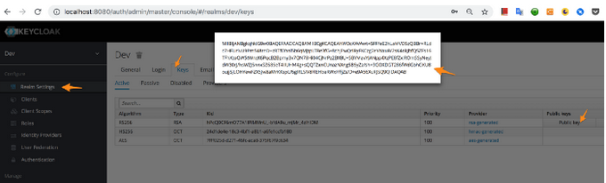

+++
title= "Go JWT Authentication with Keycloak"
date= "2019-07-27"
tags= ["RedHat SSO", "Golang", "Keycloak", "JWT"]
slug="sso-jwt-golang"
socialShare=true
+++

I recently worked on a React project with Go backend using Gin web framework. Keycloak was the authentication mechanism for the front end; I also wanted to secure the back end using JSON Web Tokens, which Keycloak provided on every login. JWT verification setup in the Go application was easy.

First, copy the `RS256` algorithm public key value from Keycloak.



Send the token as an `Authorization` header.

```javascript
axios
  .get(BACKEND_URL.concat("sampleendpoint"), {
    headers: {
      Authorization: this.state.token
    }
  })
  .then(res => {});
```

Now Go-backend setup; let's install the `jwt-go`, `gin-cors` libraries:

```bash
$ go get -u github.com/dgrijalva/jwt-go
$ go get -u github.com/gin-contrib/cors
```

Add cors config to the router to allow the `authorization` header.

```go
router.Use(cors.New(cors.Config{
  AllowOrigins:     []string{"*"},
  AllowMethods:     []string{"GET", "POST", "PUT", "DELETE", "OPTIONS", "HEAD"},
  AllowHeaders:     []string{"Origin", "content-type", "accept", "authorization"},
  ExposeHeaders:    []string{"Content-Length"},
  AllowCredentials: true,
  MaxAge:           12 * time.Hour,
}))
```

Let's create a custom handler; add the public key from Keycloak and pass it to `ParseRSAPublicKeyFromPEM`, which will return a key. The key and token are then validated.

```go
func VerifyToken(c *gin.Context) {
  SecretKey := "-----BEGIN CERTIFICATE-----\n"+
  "MIIBIjANBgkqhkiG9w0BAQEFAAOCAQ8AMIIBCgKCAQEApn
  ......
  +wnyuCHaCHp8P1yCnwIDAQAB" + "\n-----END CERTIFICATE-----"

    reqToken := c.GetHeader("Authorization")

    key, er := jwt.ParseRSAPublicKeyFromPEM([]byte(SecretKey))
    if er != nil {
        fmt.Println(er)
        c.Abort()
        c.Writer.WriteHeader(http.StatusUnauthorized)
        c.Writer.Write([]byte("Unauthorized"))
        return
    }

    token, err := jwt.Parse(reqToken, func(token *jwt.Token) (interface{}, error) {
        // Don't forget to validate the alg is what you expect:
        if _, ok := token.Method.(*jwt.SigningMethodRSA); !ok {
            return nil, fmt.Errorf("Unexpected signing method: %v", token.Header["alg"])
        }
        return key, nil
    })

    if err != nil {
        fmt.Println(err)
        c.Abort()
        c.Writer.WriteHeader(http.StatusUnauthorized)
        c.Writer.Write([]byte("Unauthorized"))
        return
    }

    if _, ok := token.Claims.(jwt.MapClaims); ok && token.Valid {
        fmt.Println("token is valid")
    }
}
```

Add the handler to the route.

```go
router.GET("/sample", VerifyToken(), handlers.SampleEndpoint)
```

That's it; if the token is valid, you will get the data from the backend, or else you'll see `401 Unauthorized.`
