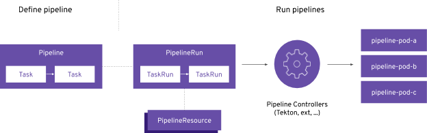
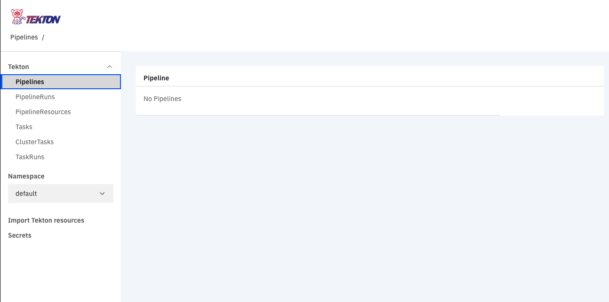
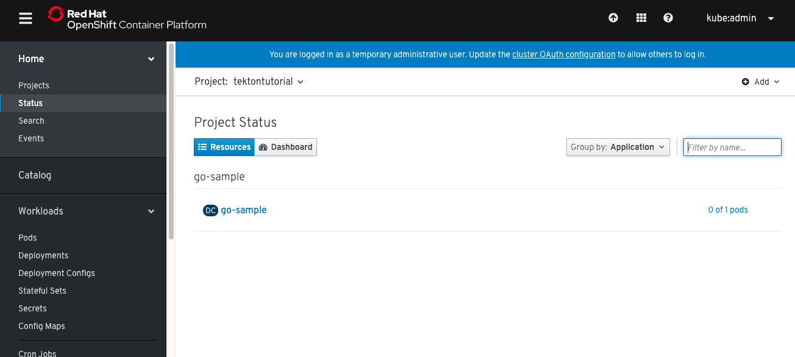
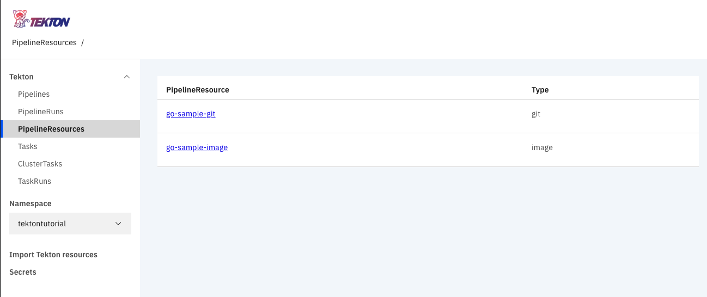
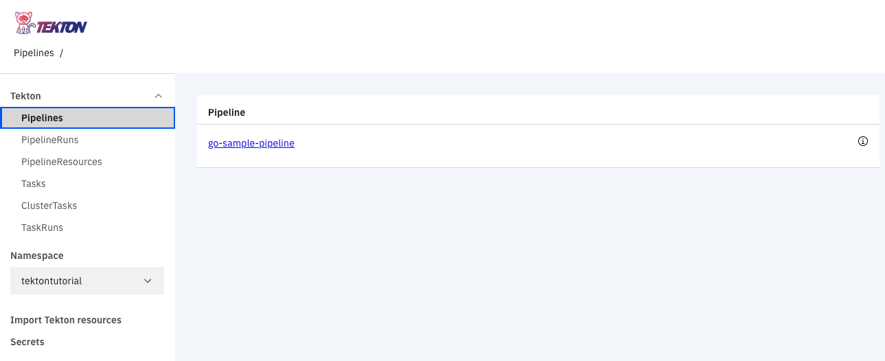
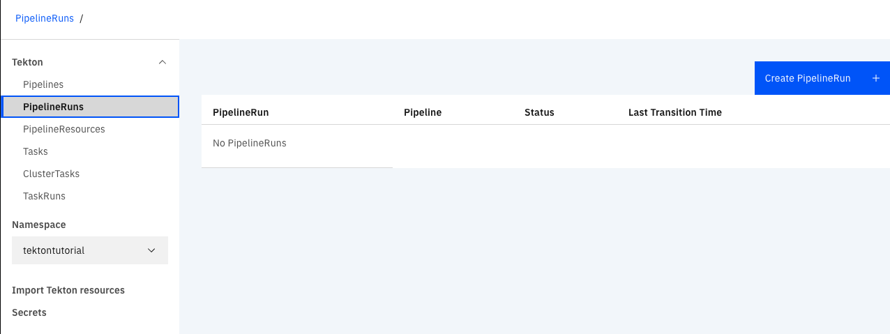
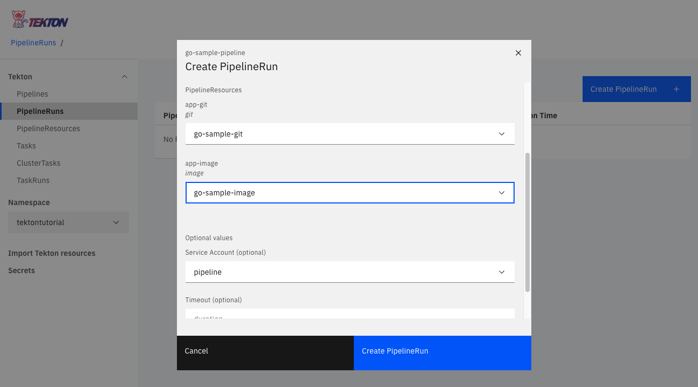
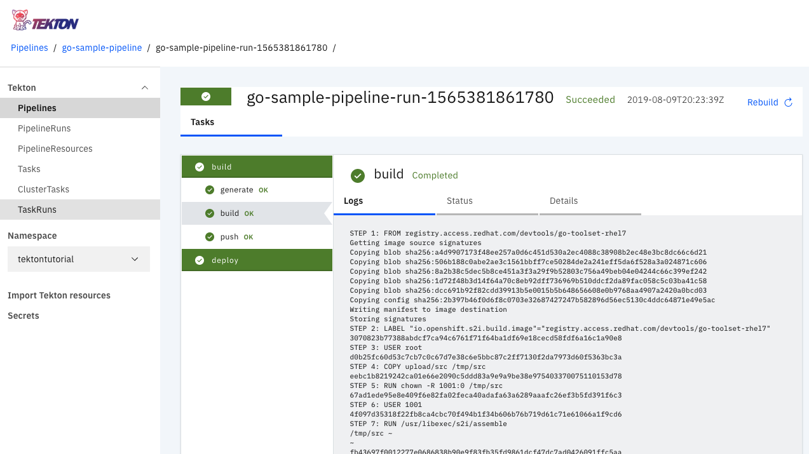

+++
title= "TektonCD on OpenShift"
date= "2019-08-09"
tags= ["OpenShift", "tektoncd"]
slug="intro-tektoncd-ocp"
socialShare=true
+++

Recently I came across [tektoncd](https://tekton.dev/) project, **_The Tekton Pipelines project provides Kubernetes-style resources for declaring CI/CD-style pipelines_** caught my attention, and I started playing with it.

## Basic Concepts



To create a Tekton pipeline, one does the following:

- Create custom or install existing reusable Tasks
- Create a Pipeline and PipelineResources to define your application's delivery pipeline
- Create a PipelineRun to instantiate and invoke the pipeline

### Installing Tekton on OpenShift

Log in as a user with `cluster-admin` privileges.

```bash
oc new-project tekton-pipelines
oc adm policy add-scc-to-user anyuid -z tekton-pipelines-controller
oc apply --filename https://storage.googleapis.com/tekton-releases/latest/release.yaml
```

### Install dashboard

The dashboard is a general-purpose, web-based UI for Tekton Pipelines. Tekton also has [cli](https://github.com/tektoncd/cli) client

```bash
curl -L https://github.com/tektoncd/dashboard/releases/download/v0/gcr-tekton-dashboard.yaml | oc apply -f -

```

Expose `tekton-dashboard` service as a route

```bash
oc expose service tekton-dashboard \
  -n tekton-pipelines \
  --name "tekton-dashboard" \
  --port="http"
```



### Create pipeline

This pipeline builds an image from the source and starts a new rollout.

Create a new project

```bash
oc new-project tektontutorial
```

Create a service account for running pipelines and enable it to run privileged pods for building images

```bash
oc create serviceaccount pipeline
oc adm policy add-scc-to-user privileged -z pipeline
oc adm policy add-role-to-user edit -z pipeline
```

Optionally, create OpenShift objects(i.e DeploymentConfig, ImageStream, Service, Route)

```yaml
---
apiVersion: image.OpenShift.io/v1
kind: ImageStream
metadata:
  labels:
    app: go-sample
  name: go-sample
---
apiVersion: apps.OpenShift.io/v1
kind: DeploymentConfig
metadata:
  labels:
    app: go-sample
  name: go-sample
spec:
  replicas: 1
  revisionHistoryLimit: 10
  selector:
    app: go-sample
    deploymentconfig: go-sample
  strategy:
    activeDeadlineSeconds: 21600
    resources: {}
    rollingParams:
      intervalSeconds: 1
      maxSurge: 25%
      maxUnavailable: 25%
      timeoutSeconds: 600
      updatePeriodSeconds: 1
    type: Rolling
  template:
    metadata:
      labels:
        app: go-sample
        deploymentconfig: go-sample
    spec:
      containers:
        - image: go-sample:latest
          imagePullPolicy: Always
          livenessProbe:
            failureThreshold: 3
            httpGet:
              path: /
              port: 8080
              scheme: HTTP
            initialDelaySeconds: 45
            periodSeconds: 10
            successThreshold: 1
            timeoutSeconds: 1
          name: go-sample
          ports:
            - containerPort: 8080
              protocol: TCP
          readinessProbe:
            failureThreshold: 3
            httpGet:
              path: /
              port: 8080
              scheme: HTTP
            initialDelaySeconds: 45
            periodSeconds: 10
            successThreshold: 1
            timeoutSeconds: 5
          resources: {}
          terminationMessagePath: /dev/termination-log
          terminationMessagePolicy: File
      dnsPolicy: ClusterFirst
      restartPolicy: Always
      schedulerName: default-scheduler
      securityContext: {}
      terminationGracePeriodSeconds: 30
  test: false
  triggers:
    - imageChangeParams:
        containerNames:
          - go-sample
        from:
          kind: ImageStreamTag
          name: go-sample:latest
          namespace: tektontutorial
      type: ImageChange
    - type: ConfigChange
---
apiVersion: v1
kind: Service
metadata:
  labels:
    app: go-sample
  name: go-sample
spec:
  ports:
    - name: 8080-tcp
      port: 8080
      protocol: TCP
      targetPort: 8080
  selector:
    app: go-sample
    deploymentconfig: go-sample
  sessionAffinity: None
  type: ClusterIP
---
apiVersion: route.OpenShift.io/v1
kind: Route
metadata:
  labels:
    app: go-sample
  name: go-sample
spec:
  port:
    targetPort: 8080-tcp
  to:
    kind: Service
    name: go-sample
    weight: 100
```

```bash
oc apply -f go-sample-template.yml
```

The deployment will not be complete since there are no container images for the `go-sample` app.



Create a `s2i-go`, `OpenShift-cli` task. You can find more examples of reusable `task`s in the [Tekton Catalog](https://github.com/tektoncd/catalog) and [OpenShift Catalog](https://github.com/OpenShift/pipelines-catalog) repositories.

**Note:** Tasks consist of several steps that get executed sequentially. The pipeline will perform each task in a separate container within the same pod.

```bash
oc apply -f https://raw.githubusercontent.com/OpenShift/pipelines-catalog/master/s2i-go/s2i-go-task.yaml
oc create -f https://raw.githubusercontent.com/tektoncd/catalog/master/OpenShift-client/OpenShift-client-task.yaml
```

Create pipeline resources

```yaml
---
apiVersion: tekton.dev/v1alpha1
kind: PipelineResource
metadata:
  name: go-sample-image
spec:
  type: image
  params:
    - name: url
      value: image-registry.OpenShift-image-registry.svc:5000/tektontutorial/go-sample
---
apiVersion: tekton.dev/v1alpha1
kind: PipelineResource
metadata:
  name: go-sample-git
spec:
  type: git
  params:
    - name: url
      value: https://github.com/go-training/helloworld
```

```bash
oc apply -f resources.yml
```



Create pipeline; pipelines have two tasks here `build` and `deploy.` Build uses `s2i-go` task to create an image from source and deploy uses `OpenShift-client` task to rollout latest deployment of `go-sample`

```yaml
apiVersion: tekton.dev/v1alpha1
kind: Pipeline
metadata:
  name: go-sample-pipeline
spec:
  resources:
    - name: app-git
      type: git
    - name: app-image
      type: image
  tasks:
    - name: build
      taskRef:
        name: s2i-go
        kind: Task
      params:
        - name: TLSVERIFY
          value: "false"
      resources:
        inputs:
          - name: source
            resource: app-git
        outputs:
          - name: image
            resource: app-image
    - name: deploy
      taskRef:
        name: OpenShift-client
        kind: ClusterTask
      runAfter:
        - build
      params:
        - name: ARGS
          value: "rollout latest go-sample"
```

```bash
oc apply -f go-sample-pipeline.yml
```



Start pipeline on the dashboard or by [tektoncli](https://github.com/tektoncd/cli)

```bash
tkn pipeline start go-sample-pipeline \
    -r app-git=go-sample-git -r app-image=go-sample-image \
    -s pipeline
```



Click on `Create PipelineRun`, select pipeline, resources, and service account and start the pipeline.



Once finished, you should see all tasks marked in green.



The `go-sample` deployment should have one running pod.
